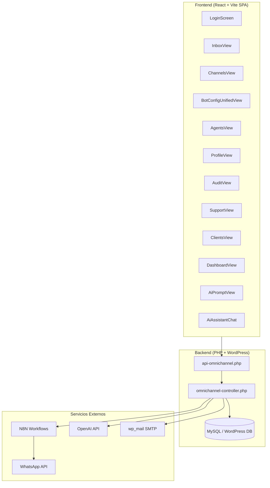
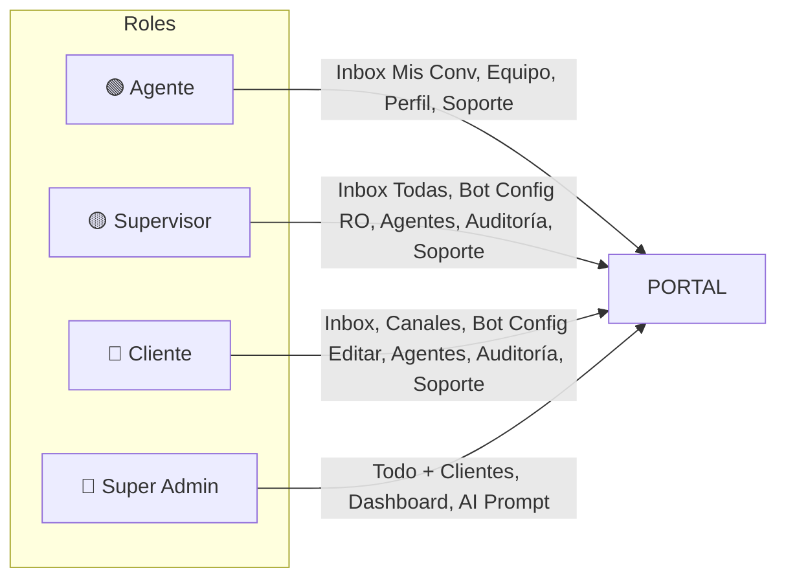
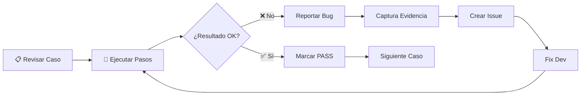

# QA-00 — Índice General y Entornos de Prueba

**Proyecto:** OmniCliente — Portal Omnicanal  
**Versión:** 1.0  
**Fecha:** 2026-03-29  
**Responsable QA:** Agente QA AutomatizaTech  

---

## Arquitectura del Portal

---

## Roles y Permisos

| Rol | Autenticación | Módulos Accesibles |
|---|---|---|
| **Agente** | Email + Contraseña | Inbox (mis conv.), Equipo (lectura), Perfil, Soporte, AI Omni |
| **Supervisor** | Email + Contraseña | Inbox (todas), Bot Config (solo lectura prompts), Agentes, Auditoría, Soporte, AI Omni |
| **Cliente** | API Key | Inbox, Canales, Tipos Canal, Bot Config (edición completa), Agentes, Auditoría, Soporte, AI Omni |
| **Super Admin** | WP User + Contraseña | TODO lo anterior + Clientes, Dashboard, AI Prompt, Soporte (master) |

---

## Entornos de Prueba

| Entorno | URL | Base de Datos |
|---|---|---|
| **Local (WAMP)** | `http://localhost/automatiza-tech/omnicliente/` | WordPress local |
| **Producción** | `https://automatizatech.cl/omnicliente/` | WordPress producción |

---

## Planes y Límites

| Plan | Canales Max | Agentes Max | AI Omni |
|---|---|---|---|
| **Basic** | 1 | 3 | ❌ |
| **Professional** | 2 | 3 | ✅ |
| **Enterprise** | 20 | 50 | ✅ |

---

## Flujo QA

---

## Índice de Archivos QA

| # | Archivo | Módulo | Casos | Prioridad |
|---|---|---|---|---|
| 01 | [QA-01-Login-Autenticacion.md](QA-01-Login-Autenticacion.md) | Login y Autenticación | 20 | Alta |
| 02 | [QA-02-Inbox-Conversaciones.md](QA-02-Inbox-Conversaciones.md) | Bandeja y Chat | 25 | Alta |
| 03 | [QA-03-Perfil-Agente.md](QA-03-Perfil-Agente.md) | Perfil del Agente | 25 | Media |
| 04 | [QA-04-Bot-Config-Prompts.md](QA-04-Bot-Config-Prompts.md) | Configuración Bot y Prompts | 29 | Alta |
| 05 | [QA-05-Gestion-Agentes.md](QA-05-Gestion-Agentes.md) | Gestión de Agentes | 22 | Alta |
| 06 | [QA-06-Canales.md](QA-06-Canales.md) | Canales y Tipos de Canal | 20 | Media |
| 07 | [QA-07-Soporte-Tickets.md](QA-07-Soporte-Tickets.md) | Sistema de Soporte | 22 | Media |
| 08 | [QA-08-Auditoria.md](QA-08-Auditoria.md) | Auditoría de Eventos | 10 | Baja |
| 09 | [QA-09-Emails-Notificaciones.md](QA-09-Emails-Notificaciones.md) | Emails y Notificaciones | 16 | Media |
| 10 | [QA-10-Asistente-AI.md](QA-10-Asistente-AI.md) | Asistente AI Omni | 17 | Media |
| 11 | [QA-11-Panel-Admin.md](QA-11-Panel-Admin.md) | Panel Admin: Clientes, Dashboard, AI Prompt | 19 | Alta |
| 12 | [QA-12-Responsive-Movil.md](QA-12-Responsive-Movil.md) | Responsive y Mobile | 22 | Media |

---

## Convenciones

- **IDs de casos:** Prefijo del módulo + número secuencial (ej: `LG-001`, `IN-020`)
- **Prioridades:** Alta (bloqueante), Media (funcional), Baja (cosmético)
- **Evidencias:** Capturas en carpeta `evidencias/` referenciadas como ``
- **Estados:** ✅ PASS | ❌ FAIL | ⏸️ SKIP | 🔄 RETEST
