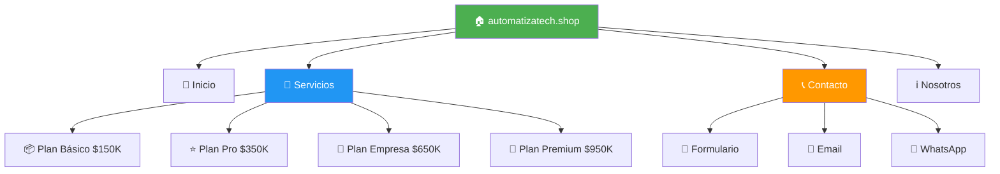
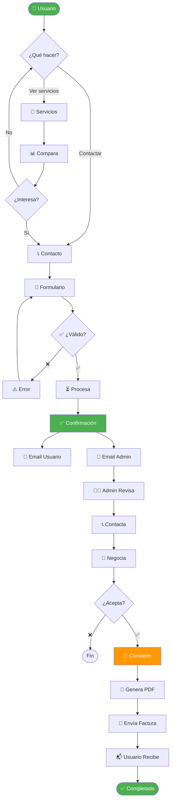
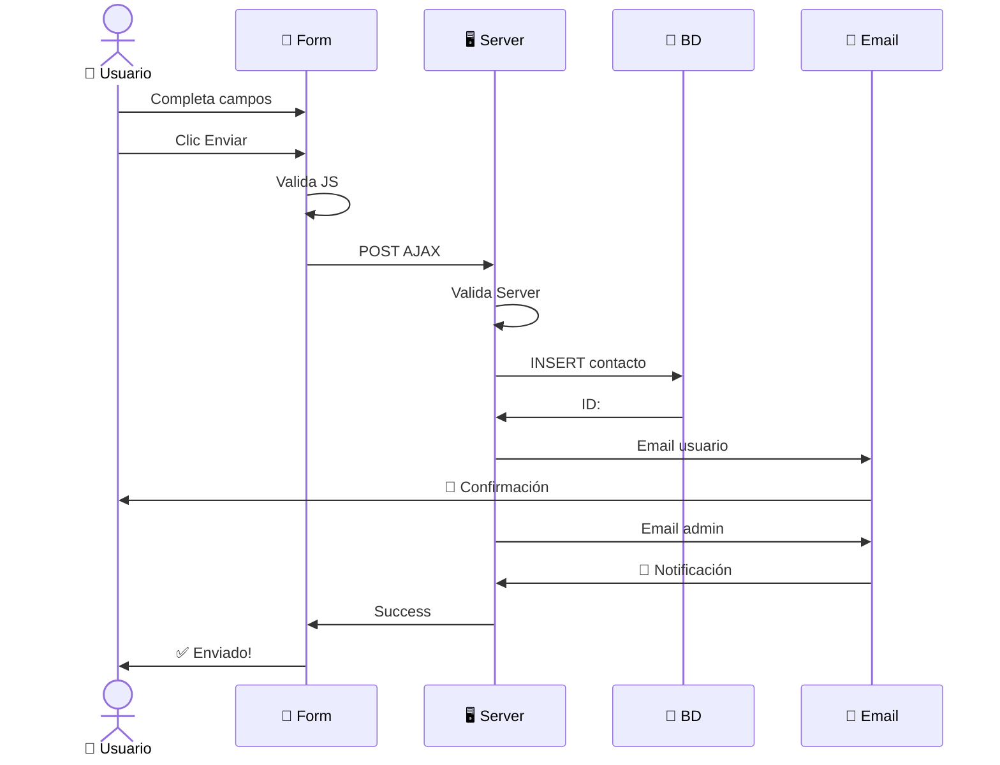
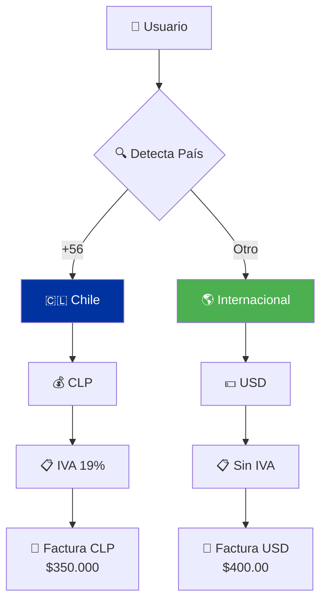
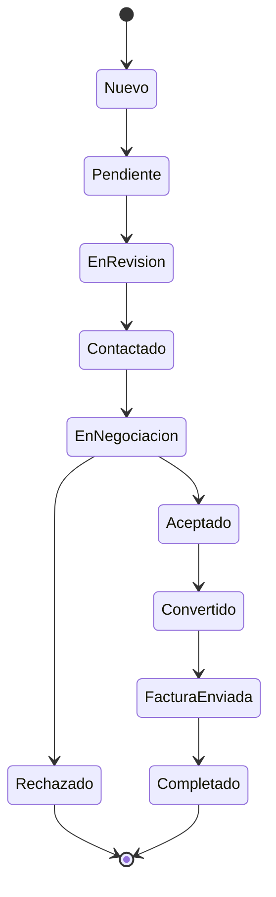
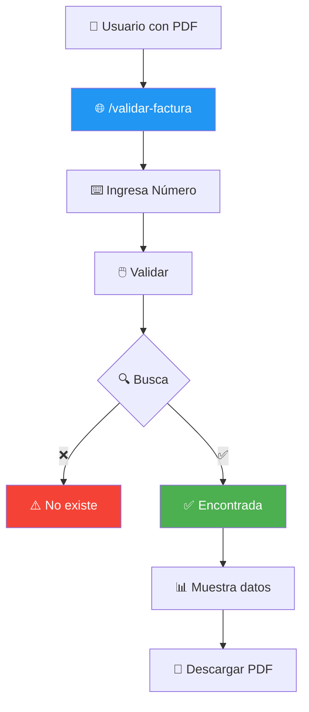
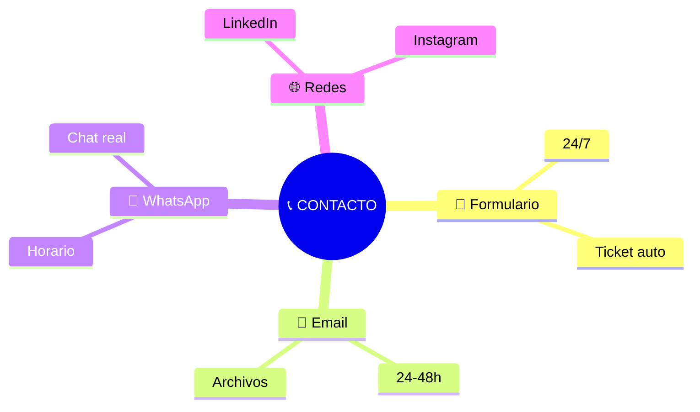

# 🌐 Diagrama Visual - Usuario Frontend (Mermaid)

**Sistema AutomatizaTech - Documentación Visual**  
**Versión:** 2.0

---

## 📊 Vista General del Sitio



---

## 🚀 Flujo Completo: Visita → Factura



---

## 📝 Formulario - Secuencia



---

## 🌍 Chile vs Internacional



---

## ⏱️ Línea de Tiempo

```mermaid
gantt
    title Usuario: Contacto a Factura
    dateFormat HH:mm
    section Usuario
    Visita sitio          :a1, 00:00, 5m
    Llena formulario      :a2, 00:05, 3m
    Envía                 :a3, 00:08, 1m
    Espera admin          :crit, a4, 00:09, 1440m
    section Sistema
    Procesa               :b1, 00:09, 10s
    Emails                :b2, 00:09, 5s
    section Admin
    Revisa                :c1, 24:09, 10m
    Contacta              :c2, 24:19, 30m
    Negocia               :c3, 24:49, 60m
    Convierte             :c4, 25:49, 2m
    section Factura
    Genera PDF            :d1, 25:51, 3s
    Envía email           :crit, d2, 25:51, 2s
    Usuario recibe        :milestone, 25:51, 0m
```

---

## 📊 Estados del Contacto



---

## 🔐 Validación Online



---

## 📱 Canales Contacto



---

**Consultar MANUAL-USUARIO.md para detalles**

---

**AutomatizaTech Development Team - Nov 2025**
