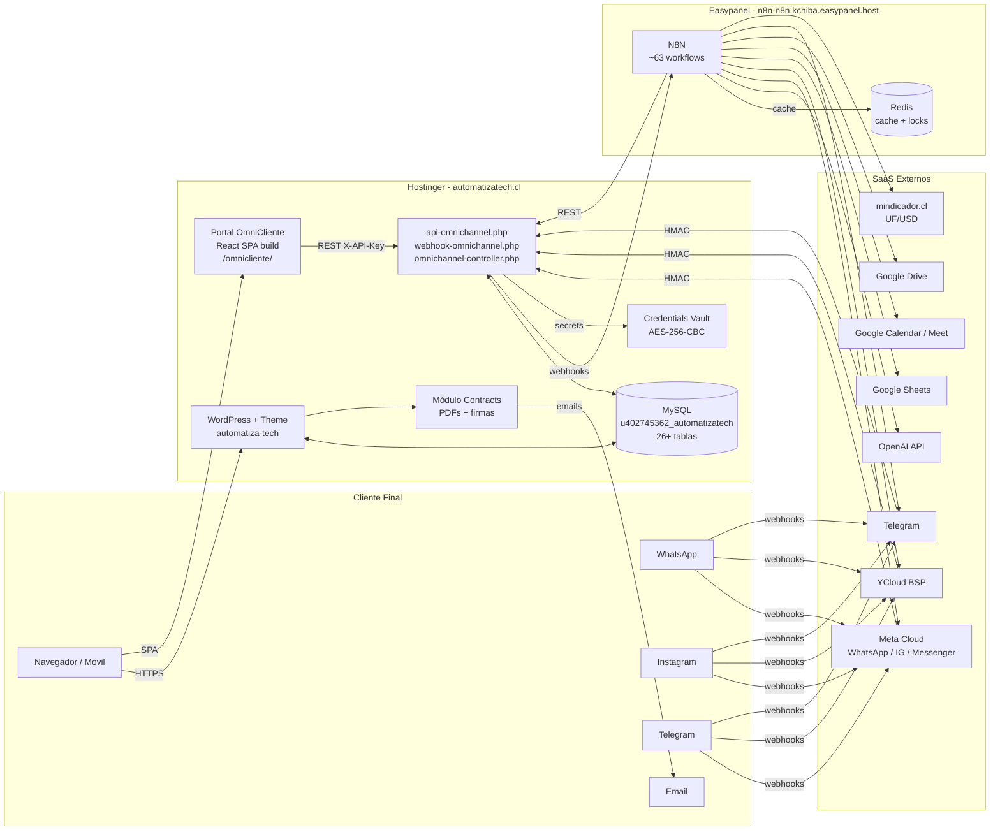

# 01 — Arquitectura General del Ecosistema AutomatizaTech

## 🎯 Visión

AutomatizaTech es una plataforma híbrida que combina:

- **Web institucional + CRM** sobre WordPress (theme custom `automatiza-tech`).
- **Portal OmniCliente** SPA en React (Vite) embebido vía iframe/build.
- **Backend de orquestación omnicanal** en PHP plano (controladores en raíz del WP).
- **Capa de automatización N8N** (~63 workflows) para bots de WhatsApp/IG/Telegram, ventas, agendamiento, recordatorios.
- **Integraciones externas:** OpenAI, YCloud, Google Workspace (Calendar/Sheets/Drive/Meet), Meta Cloud, Telegram, Redis, mindicador.cl.
- **Sistema de contratos** con firma electrónica doble.

---

## 🏗️ Stack tecnológico

| Capa | Tecnología | Versión / Notas |
|------|-----------|-----------------|
| CMS / Sitio | WordPress + theme custom `automatiza-tech` | PHP 8.x |
| Backend orchestrator | PHP plano (no framework) | Archivos en raíz: `omnichannel-controller.php`, `api-omnichannel.php`, `webhook-omnichannel.php` |
| BD | MySQL (Hostinger) | InnoDB, charset `utf8mb4` |
| Frontend Portal | React 19.1.0 + Vite 6.3.5 + Tailwind 3.4.17 | Carpeta `client-portal-omnichannel/`, build en `omnicliente/` |
| Automatización | N8N self-hosted | `https://n8n-n8n.kchiba.easypanel.host` (Easypanel) |
| Cache | LiteSpeed Cache (plugin WP) | Hostinger nativo |
| Auth API | Custom: `X-API-Key` (cliente), `X-Admin-Token` (admin), `X-Agent-Token` (agente) | Ver `05_API_BACKEND_PHP.md` |
| LLM | OpenAI (GPT-4/GPT-4o-mini) | Usage tracking en `ai_usage_log` |
| Mensajería | Meta Cloud API (WhatsApp), YCloud (WhatsApp BSP), Telegram Bot API, Instagram Graph API, Messenger | Webhooks vía `webhook-omnichannel.php` |
| Voz/Video | Google Meet (vía Calendar API) | — |
| Pagos | (Pendiente — Transbank planificado, no implementado) | — |
| Firma electrónica | Sistema propio con SHA-256 + canvas/upload | Módulo `contracts/` |

---

## 🌐 Topología (alto nivel)



---

## 🌍 Ambientes

| Ambiente | URL | Notas |
|----------|-----|-------|
| **Producción** | `https://automatizatech.cl` | Hostinger, branch `prod-sync-2025-06-26` (histórica) |
| **Desarrollo local** | `http://localhost/automatiza-tech` | WAMP64 (`c:\wamp64\www\automatiza-tech`), branch actual `security/hardening-phase-0` |
| **N8N** | `https://n8n-n8n.kchiba.easypanel.host` | Compartido prod/dev |

> ⚠️ **Importante:** N8N es único; los workflows productivos apuntan a la URL de producción. Para desarrollar workflows nuevos sin afectar prod, duplicar el workflow con sufijo `_DEV` y cambiar la URL del nodo HTTP.

---

## 🔐 Modelo de seguridad (resumen)

- **Branch dedicada:** `security/hardening-phase-0` con 9 helpers `at-*.php`.
- **Reglas .htaccess** que bloquean `xmlrpc.php`, scripts `debug-*.php` / `setup-*.php` / `check-*.php`, archivos `.bak`/`.sql`/`.env`.
- **Headers:** `X-Content-Type-Options`, `X-Frame-Options: SAMEORIGIN`, `Referrer-Policy`, `Permissions-Policy`.
- **Auth API:** triple modo (`X-API-Key` cliente, `X-Admin-Token`, `X-Agent-Token`).
- **Webhooks N8N:** firma HMAC-SHA256 con `X-AT-Signature` + `X-AT-Timestamp` (tolerancia 300 s).
- **Credentials Vault:** secretos cifrados AES-256-CBC en BD (`wp_omnichannel_vault_secrets`).
- **CI/CD:** GitHub Actions con `gitleaks`, lint PHP, patrones de seguridad.

Detalle completo en `10_SEGURIDAD_HARDENING.md`.

---

## 🔁 Flujos críticos del negocio

1. **Captura de lead web** → Form WP → AJAX → BD `wp_automatiza_tech_leads` → notifica N8N.
2. **Conversación omnicanal entrante** → Webhook (WhatsApp/IG/TG) → `webhook-omnichannel.php` (HMAC) → BD `wp_omnichannel_messages` → trigger workflow N8N (bot) → respuesta IA → envío canal.
3. **Bot WhatsApp v8** → Lee Portal API (no GSheets) → cache Redis 5 min → fallback GSheets si falla.
4. **Agendamiento de cita** → Bot/Portal → Google Calendar → genera Meet → confirma por canal.
5. **Propuesta comercial** → Backoffice WP genera → PDF → envía cliente → cliente acepta → genera contrato.
6. **Contrato firma doble** → Admin crea → revisor AT firma (login + nonce) → cliente firma (token público) → PDF final con SHA-256.

Detalle en `12_FLUJOS_DE_NEGOCIO.md`.

---

## 📁 Estructura de carpetas (resumen)

```
automatiza-tech/
├── wp-content/themes/automatiza-tech/   # Theme custom
│   ├── functions.php                    # Bootstrap (~100 KB)
│   ├── inc/                             # Módulos (api-endpoints, ajax handlers, ...)
│   └── (templates, assets)
├── client-portal-omnichannel/           # SPA React (source)
│   ├── src/
│   │   ├── api.js                       # Cliente API (370 líneas, 60+ endpoints)
│   │   └── components/                  # 25+ componentes
│   └── package.json
├── omnicliente/                         # Build deployado del portal
├── contracts/                           # Módulo firma electrónica
├── N8N/                                 # Backups de workflows
│   ├── PROD/                            # 38 workflows productivos
│   ├── TEMPLATES/kellscapilar/          # 8 plantillas + bot v8
│   └── (genéricos en raíz)
├── sql/                                 # Schemas y migraciones
├── Docs/                                # Documentación
│   └── MASTER/                          # ← ESTÁ AQUÍ (esta carpeta)
├── tools/                               # Scripts utilitarios
├── omnichannel-controller.php           # 222 KB orquestador
├── api-omnichannel.php                  # 87 KB REST API
├── webhook-omnichannel.php              # Receptor webhooks
├── at-*.php                             # 9 helpers seguridad
├── setup-*.php / migrate-*.php          # Scripts BD (28+)
├── debug-*.php / check-*.php            # Scripts diagnóstico (24+)
└── .htaccess                            # Hardening + WP rewrites
```

Detalle archivo-por-archivo en `02_MAPEO_ARCHIVOS.md`.
