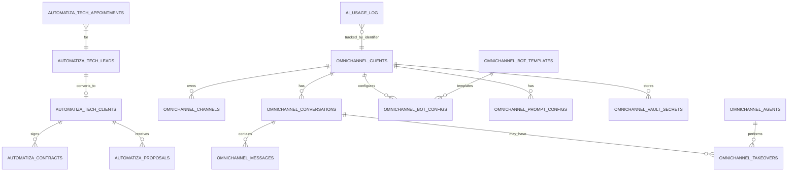

# 03 — Base de Datos

> **Motor:** MySQL (Hostinger), InnoDB, charset `utf8mb4`.
> **BD producción:** `u402745362_automatizatech`
> **Total tablas custom:** ~26 (sin contar las nativas de WordPress).
> **Naming:** prefijo `wp_automatiza_*` (CRM/leads/contratos), `wp_omnichannel_*` (mensajería), `ai_usage_log` (sin prefijo, IA).

---

## 🗂️ Dominios funcionales

| Dominio | Tablas | Propósito |
|---------|--------|-----------|
| **Omnichannel** | 15 | Conversaciones, mensajes, agentes, bots, takeovers |
| **Leads / Citas** | 3 | CRM de captación |
| **Propuestas / Contratos** | 5 | Pipeline comercial + firmas |
| **IA Tracking** | 2 | Costos OpenAI, prompts |
| **Credentials Vault** | 2 | Secretos cifrados AES-256-CBC |
| **N8N Errors** | 1 | Log centralizado de fallas N8N |
| **Analytics** | 5 | Métricas internas |

---

## 📊 Diagrama ER (resumen)

---

## 🔵 Dominio Omnichannel (15 tablas)

### `wp_omnichannel_clients`
Cliente del SaaS (cada empresa que usa el sistema).

| Columna | Tipo | Notas |
|---------|------|-------|
| `id` | BIGINT PK | |
| `name` | VARCHAR(255) | Razón social |
| `slug` | VARCHAR(100) UNIQUE | Identificador URL-safe |
| `email` | VARCHAR(190) | |
| `phone` | VARCHAR(40) | |
| `api_key` | VARCHAR(64) | Token Portal (X-API-Key) |
| `portal_enabled` | TINYINT(1) | Si puede acceder al Portal |
| `master_email` | VARCHAR(190) | Email principal de notificaciones |
| `created_at`, `updated_at` | DATETIME | |

### `wp_omnichannel_channels`
Canales activos por cliente (WhatsApp/IG/TG/Messenger).

| Columna | Tipo | Notas |
|---------|------|-------|
| `id` | BIGINT PK | |
| `client_id` | BIGINT FK | → `omnichannel_clients` |
| `type` | ENUM | `whatsapp_meta`, `whatsapp_ycloud`, `instagram`, `telegram`, `messenger` |
| `external_id` | VARCHAR(190) | Phone number id / IG user id |
| `display_name` | VARCHAR(190) | |
| `credentials_ref` | VARCHAR(190) | Ref a vault |
| `webhook_secret` | VARCHAR(190) | HMAC del proveedor |
| `is_active` | TINYINT(1) | |

### `wp_omnichannel_conversations`
Hilo de conversación con un contacto.

| Columna | Tipo | Notas |
|---------|------|-------|
| `id` | BIGINT PK | |
| `client_id`, `channel_id` | BIGINT FK | |
| `contact_phone` / `contact_handle` | VARCHAR | Identificador del contacto |
| `contact_name` | VARCHAR | |
| `status` | ENUM | `open`, `pending`, `closed`, `archived` |
| `assigned_agent_id` | BIGINT NULL | FK → `agents` |
| `last_message_at` | DATETIME | Para sort inbox |
| `unread_count` | INT | |
| `metadata` | LONGTEXT JSON | Tags, custom fields |

### `wp_omnichannel_messages`
Cada mensaje (in/out, texto/media).

| Columna | Tipo | Notas |
|---------|------|-------|
| `id` | BIGINT PK | |
| `conversation_id` | BIGINT FK | |
| `direction` | ENUM | `inbound`, `outbound` |
| `sender_type` | ENUM | `contact`, `bot`, `agent`, `system` |
| `sender_id` | BIGINT NULL | agent_id si aplica |
| `body` | LONGTEXT | Texto |
| `media_url`, `media_type` | VARCHAR | |
| `external_id` | VARCHAR | ID del proveedor (idempotencia) |
| `status` | ENUM | `sent`, `delivered`, `read`, `failed` |
| `created_at` | DATETIME | |

### `wp_omnichannel_agents`
Agentes humanos del SaaS.

| Columna | Tipo | Notas |
|---------|------|-------|
| `id` | BIGINT PK | |
| `client_id` | BIGINT FK | |
| `name`, `email` | VARCHAR | |
| `password_hash` | VARCHAR(255) | bcrypt |
| `role` | ENUM | `agent`, `supervisor`, `admin` |
| `agent_token` | VARCHAR(64) | Para `X-Agent-Token` |
| `is_active` | TINYINT(1) | |
| `last_login_at` | DATETIME | |

### `wp_omnichannel_takeovers`
Cuándo un agente toma control de la conversación (pausando bot).

| Columna | Tipo | Notas |
|---------|------|-------|
| `conversation_id`, `agent_id` | BIGINT FK | |
| `started_at`, `ended_at` | DATETIME | |
| `reason` | VARCHAR | Opcional |

### `wp_omnichannel_bot_configs`
Configuración del bot por cliente.

| Columna | Tipo | Notas |
|---------|------|-------|
| `client_id` | BIGINT | |
| `template_id` | BIGINT FK | → `bot_templates` |
| `is_enabled` | TINYINT(1) | |
| `config_json` | LONGTEXT | Overrides del template |
| `model` | VARCHAR | `gpt-4o-mini` por defecto |
| `temperature` | DECIMAL | |

### `wp_omnichannel_prompt_configs`
Prompts personalizados por cliente / contexto.

### `wp_omnichannel_bot_templates`
Plantillas de bot (definidas por AT, instanciadas por cliente).

### `wp_omnichannel_n8n_workflows`
Catálogo de workflows N8N disponibles + URLs webhook + estado.

### `wp_omnichannel_audit_log`
Auditoría de acciones críticas (cambios bot, takeover, eliminaciones).

### `wp_omnichannel_n8n_errors`
Errores reportados por N8N (vía endpoint dedicado).

| Columna | Tipo | Notas |
|---------|------|-------|
| `workflow_id`, `node_name` | VARCHAR | |
| `error_message` | TEXT | |
| `payload` | LONGTEXT JSON | |
| `severity` | ENUM | `info`, `warn`, `error`, `critical` |
| `resolved` | TINYINT(1) | |

### `wp_omnichannel_vault_secrets`
Secretos cifrados (AES-256-CBC) — ver `10_SEGURIDAD_HARDENING.md`.

| Columna | Tipo | Notas |
|---------|------|-------|
| `client_id` | BIGINT FK | |
| `secret_key` | VARCHAR(120) | Ej: `openai_api_key` |
| `secret_value_enc` | LONGTEXT | Cifrado base64 |
| `iv` | VARCHAR(64) | IV del cifrado |
| `created_at`, `updated_at` | DATETIME | |

### `wp_omnichannel_vault_master`
Master key cifrada (single row).

### (otras menores: `wp_omnichannel_settings`, `wp_omnichannel_attachments`)

---

## 🟢 Dominio Leads / Citas (3 tablas)

### `wp_automatiza_tech_leads`

| Columna | Tipo | Notas |
|---------|------|-------|
| `id` | BIGINT PK | |
| `name`, `email`, `phone` | VARCHAR | |
| `source` | VARCHAR | `web_form`, `whatsapp_bot`, `referido` |
| `interest` | VARCHAR | Servicio de interés |
| `status` | ENUM | `nuevo`, `contactado`, `cualificado`, `cliente`, `descartado` |
| `notes` | TEXT | |
| `assigned_to` | BIGINT NULL | user_id WP |
| `metadata` | LONGTEXT JSON | UTM, IP, UA |

### `wp_automatiza_tech_appointments`

| Columna | Tipo | Notas |
|---------|------|-------|
| `id` | BIGINT PK | |
| `lead_id` | BIGINT FK | |
| `scheduled_at` | DATETIME | |
| `duration_min` | INT | |
| `meet_url` | VARCHAR(500) | Google Meet |
| `gcal_event_id` | VARCHAR(190) | |
| `status` | ENUM | `pending`, `confirmed`, `cancelled`, `no_show`, `completed` |

### `wp_automatiza_tech_clients`
Clientes finales (firman contratos, reciben propuestas).

| Columna | Tipo | Notas |
|---------|------|-------|
| `id` | BIGINT PK | |
| `business_name`, `rut`, `legal_rep` | VARCHAR | |
| `email`, `phone`, `address` | VARCHAR | |
| `lead_id` | BIGINT NULL FK | Origen |

---

## 🟣 Dominio Propuestas / Contratos (5 tablas)

### `wp_automatiza_proposals`

| Columna | Tipo | Notas |
|---------|------|-------|
| `id` | BIGINT PK | |
| `client_id` | BIGINT FK | |
| `proposal_number` | VARCHAR(40) | `AT-PROP-YYYYMMDD-XXXXX` |
| `status` | ENUM | `draft`, `sent`, `viewed`, `accepted`, `rejected`, `expired` |
| `total_amount`, `currency` | DECIMAL, CHAR(3) | |
| `pdf_url` | VARCHAR(500) | |
| `view_token` | VARCHAR(64) | Acceso público |
| `valid_until` | DATETIME | |

### `wp_automatiza_proposal_items`
Líneas de la propuesta.

### `wp_automatiza_contracts`
Ver detalle completo en `09_MODULO_CONTRATOS.md`.

### `wp_automatiza_contract_events`
Auditoría de eventos del contrato (visto, firmado, etc.).

### `wp_automatiza_projects`
Proyectos en ejecución (post-contrato).

---

## 🟡 Dominio IA Tracking (2 tablas)

### `ai_usage_log`
> ⚠️ Esta tabla NO usa el prefijo `wp_` (decisión histórica).

| Columna | Tipo | Notas |
|---------|------|-------|
| `id` | BIGINT PK | |
| `client_identifier` | VARCHAR(190) | Slug del cliente o `internal` |
| `model` | VARCHAR(80) | `gpt-4o-mini`, etc. |
| `prompt_tokens`, `completion_tokens`, `total_tokens` | INT | |
| `cost_usd` | DECIMAL(10,6) | Calculado |
| `endpoint` | VARCHAR | `chat`, `embeddings`, etc. |
| `metadata` | LONGTEXT JSON | conversation_id, workflow_id |
| `created_at` | DATETIME | |

### `wp_omnichannel_ai_prompts_log`
Histórico de prompts ejecutados (debugging IA).

---

## 🔴 Dominio Analytics (5 tablas)

| Tabla | Propósito |
|-------|-----------|
| `wp_automatiza_metrics_daily` | KPI diarios (leads, conversaciones, conversiones) |
| `wp_automatiza_funnel_events` | Eventos del funnel (web → lead → cliente) |
| `wp_automatiza_bot_stats` | Estadísticas por bot/cliente |
| `wp_automatiza_ai_costs_monthly` | Costos OpenAI mensuales agregados |
| `wp_automatiza_audit_admin` | Auditoría acciones admin WP |

---

## 🛠️ Migraciones documentadas

| Script | Cambio |
|--------|--------|
| `setup-omnichannel.php` | Bootstrap inicial (15 tablas omnichannel) |
| `setup-omnichannel-v2.php` | + columnas YCloud en `channels` |
| `setup-omnichannel-v3.php` | + `password_hash`, `agent_token`, `last_login_at` en `agents` |
| `setup-credentials-vault.php` | + `vault_secrets` + `vault_master` |
| `setup-bot-templates.php` | + `bot_templates` y seed inicial |
| `setup-prompts-config.php` | + `prompt_configs` |
| `setup-takeovers.php` | + `takeovers` |
| `setup-n8n-workflows-table.php` | + `n8n_workflows` (catálogo) |
| `setup-ai-usage-log.php` | + `ai_usage_log` |
| `setup-contracts-db.php` | + `wp_automatiza_contracts` (clave `AT_SETUP_2026`) |
| `migrate-clients-add-portal.php` | + `api_key`, `portal_enabled` en `omnichannel_clients` |
| `add-message-status-cols.php` | + `delivered_at`, `read_at` en `messages` |
| `add-conversation-tags.php` | + `tags` en `conversations` |
| `fix-charset-utf8mb4.php` | Convierte tablas viejas a `utf8mb4` |
| (otras ~3 menores) | Ver `Get-ChildItem setup-*.php, migrate-*.php` |

> ⚠️ **Anti-patrón actual:** Las migraciones se ejecutan vía hook `init` cada request si se incluyen, sin flag de versión. Recomendación pendiente: implementar tabla `wp_automatiza_db_version` con número de migración aplicada.

---

## 🔑 Índices importantes

- `omnichannel_messages`: `INDEX (conversation_id, created_at)` — paginación inbox.
- `omnichannel_messages`: `UNIQUE (channel_id, external_id)` — idempotencia webhooks.
- `omnichannel_conversations`: `INDEX (client_id, status, last_message_at)` — sort inbox.
- `ai_usage_log`: `INDEX (client_identifier, created_at)` — reportes mensuales.
- `automatiza_contracts`: `UNIQUE (sign_token)`, `UNIQUE (at_review_token)`.

---

## 💾 Backups

- Hostinger: backup diario automático (retention 7 días).
- Manual: `mysqldump -u u402745362_automatiza -p u402745362_automatizatech > backup-YYYYMMDD.sql`.
- Restauración local: importar SQL en WAMP MySQL (`localhost:3306`).
