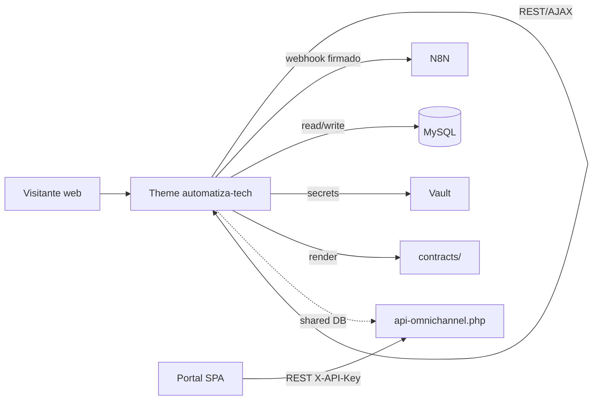

# 04 — Theme WordPress `automatiza-tech`

> **Ubicación:** `wp-content/themes/automatiza-tech/`
> **Propósito:** Theme custom que sirve el sitio público + el backoffice CRM + provee endpoints REST y AJAX para el ecosistema (Portal, N8N, integraciones).
> **Tamaño aproximado:** 40+ archivos PHP, `functions.php` ~100 KB.

---

## 🧱 Bootstrap (functions.php)

`functions.php` es el orquestador del theme. Carga todos los módulos `inc/`, registra:

- Soporte de theme (`add_theme_support`).
- Menús, widgets, sidebars.
- Custom Post Types (CPT): `propuesta`, `contrato`, `caso_exito`.
- Custom Taxonomies.
- Hooks de autenticación (login con email).
- Inclusión de helpers `at-*.php` raíz.
- Carga del módulo de contratos.
- Inicialización del Vault de credenciales.
- Migraciones `setup-*.php` invocadas vía hook `init` (anti-patrón: ver `03_BASE_DE_DATOS.md`).

---

## 📦 Módulos `inc/` (resumen)

| Archivo | Responsabilidad |
|---------|-----------------|
| `api-endpoints.php` (~2090 líneas) | **25+ endpoints REST** en `/wp-json/automatiza-tech/v1/` |
| `ajax-handlers.php` | **45+ AJAX handlers** (`wp_ajax_*`, `wp_ajax_nopriv_*`) |
| `crm-functions.php` | Funciones del CRM (leads, citas, propuestas) |
| `dashboard-stats.php` | KPIs para el backoffice |
| `email-templates.php` | Plantillas HTML (lead nuevo, propuesta enviada, etc.) |
| `meta-boxes.php` | Custom fields para CPTs |
| `shortcodes.php` | 3 shortcodes: `[at_form_contacto]`, `[at_dashboard]`, `[at_listado_servicios]` |
| `theme-setup.php` | `add_theme_support`, registro CPT/Tax |
| `enqueue-assets.php` | Carga JS/CSS (admin + público) |
| `oauth-callbacks.php` | Callbacks de Google/Meta OAuth |
| `n8n-bridge.php` | Helpers para invocar webhooks N8N firmados (HMAC) |
| `vault-bridge.php` | Acceso al Vault de credenciales desde el theme |

---

## 🌐 Endpoints REST (`/wp-json/automatiza-tech/v1/`)

> Definidos en `inc/api-endpoints.php`. Usan `register_rest_route`. La mayoría requiere capability `manage_options` o token compartido. Lista resumida:

| Método | Ruta | Propósito | Auth |
|--------|------|-----------|------|
| `POST` | `/leads` | Crear lead desde form externo | Token / nopriv + rate-limit |
| `GET` | `/leads` | Listar leads | `manage_options` |
| `PATCH` | `/leads/{id}` | Actualizar status | `edit_posts` |
| `POST` | `/appointments` | Agendar cita | Token + rate-limit |
| `GET` | `/appointments` | Listar | `edit_posts` |
| `POST` | `/proposals` | Crear propuesta | `edit_posts` |
| `GET` | `/proposals/{id}` | Detalle | `edit_posts` o token público |
| `POST` | `/proposals/{id}/send` | Enviar al cliente | `edit_posts` |
| `POST` | `/proposals/{id}/accept` | Aceptar (público con token) | Token |
| `GET` | `/clients` | Listar clientes | `manage_options` |
| `POST` | `/clients` | Crear cliente | `manage_options` |
| `GET` | `/services` | Listado público de servicios | Público |
| `POST` | `/contact` | Form de contacto | nopriv + rate-limit |
| `GET` | `/dashboard/stats` | KPIs backoffice | `manage_options` |
| `POST` | `/n8n/error` | Receptor de errores N8N | HMAC |
| `POST` | `/n8n/log` | Log centralizado N8N | HMAC |
| `GET` | `/uf` | UF/USD/Euro vía mindicador.cl (cache 1h) | Público |
| `GET` | `/health` | Healthcheck | Público |
| (otros ~10) | | | |

> 📋 **Convención de respuestas:** todas devuelven `{ ok: bool, data?: any, error?: string, code?: string }`.

---

## ⚡ AJAX Handlers (`admin-ajax.php`)

Patrón: `wp_ajax_<action>` (logged) y `wp_ajax_nopriv_<action>` (público). Ejemplos:

| Action | Tipo | Propósito |
|--------|------|-----------|
| `at_save_lead` | nopriv | Form de contacto público |
| `at_book_appointment` | nopriv | Agendamiento desde landing |
| `at_get_available_slots` | nopriv | Disponibilidad de calendario |
| `at_save_proposal` | priv | Guarda borrador de propuesta |
| `at_send_proposal` | priv | Envía propuesta por email |
| `at_create_contract` | priv | Crea contrato (delega a `contracts/`) |
| `at_load_dashboard_widgets` | priv | Refresh dashboard |
| `at_assign_agent` | priv | Asigna agente a conversación |
| `at_take_conversation` | priv | Takeover (pausa bot) |
| `at_release_conversation` | priv | Suelta takeover |
| `at_test_n8n_webhook` | priv | Test conectividad N8N |
| `at_vault_get_secret` | priv | Lee secreto del vault (admin only) |
| `at_vault_set_secret` | priv | Guarda secreto |
| (otros 30+) | | |

> Todos los handlers `priv` deben usar `at_ajax_require_nonce()` y `at_ajax_require_cap()` del helper `at-ajax-guard.php`.

---

## 🪝 Hooks principales registrados

| Hook | Callback | Acción |
|------|----------|--------|
| `init` | `at_run_pending_migrations` | Ejecuta migraciones (anti-patrón) |
| `init` | `at_register_cpts` | Registra CPTs |
| `rest_api_init` | `at_register_rest_routes` | Registra endpoints REST |
| `wp_enqueue_scripts` | `at_enqueue_public_assets` | CSS/JS público |
| `admin_enqueue_scripts` | `at_enqueue_admin_assets` | CSS/JS admin |
| `admin_menu` | `at_register_admin_menus` | Menús backoffice (Contactos, Propuestas, Contratos, etc.) |
| `wp_login` | `at_log_admin_login` | Auditoría |
| `template_redirect` | `at_handle_public_token_pages` | Páginas con `?token=` (propuestas, contratos) |

---

## 🎨 Shortcodes

| Shortcode | Uso | Atributos |
|-----------|-----|-----------|
| `[at_form_contacto]` | Form principal de contacto | `tema="oscuro\|claro"` |
| `[at_dashboard]` | Dashboard cliente (post-login) | `vista="resumen\|propuestas\|contratos"` |
| `[at_listado_servicios]` | Grid de servicios | `categoria="..."`, `cols="3"` |

---

## 🗂️ Templates (jerarquía WordPress)

- `index.php`, `single.php`, `page.php`, `archive.php`, `404.php`
- `header.php`, `footer.php`, `sidebar.php`
- `template-parts/` (snippets reutilizables: cards, forms, hero)
- Templates específicos: `page-contacto.php`, `page-portal.php`, `single-propuesta.php`

---

## 🎨 Assets

- `assets/css/` — Hoja principal + módulos por sección
- `assets/js/` — Vanilla JS para forms, AJAX, tracking
- `assets/img/` — Imágenes del theme (logos, hero, etc.)
- Build: no requiere build (no Webpack/Vite en el theme)

---

## 🔗 Integración con el resto del ecosistema

---

## ⚠️ Quirks importantes

1. **`functions.php` es enorme (~100 KB)** — refactorizar incrementalmente extrayendo a `inc/` por dominio.
2. **Migraciones en `init`** — cada request las re-evalúa (idempotente pero costoso). Migrar a flag de versión.
3. **Webhooks N8N hardcoded** — varios endpoints de N8N están escritos como strings en `inc/n8n-bridge.php`. Mover a opciones WP (`get_option('at_n8n_webhook_url')`).
4. **Logs:** algunos endpoints hacen `error_log(print_r($_POST, true))` — eliminar (info leak, ver CI security-scan).
5. **Carga de assets:** revisar que `wp_enqueue_script` use `filemtime()` para cache busting.
