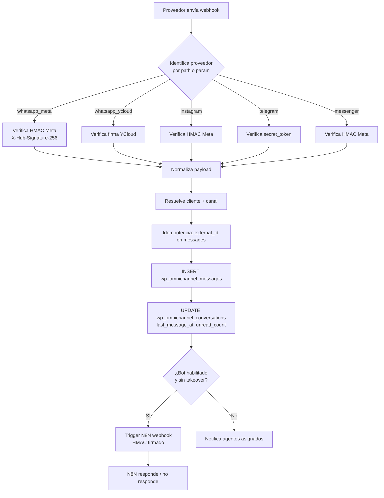

# 05 — API Backend PHP (Raíz del proyecto)

> **Stack:** PHP 8.x plano (no framework). Bootstrap mínimo (`require wp-load.php` para usar WPDB y opciones).
> **Archivos clave:** `api-omnichannel.php`, `webhook-omnichannel.php`, `omnichannel-controller.php`, `omnichannel-bot.php`.

---

## 🎯 Responsabilidades

- Servir el **endpoint REST** que consume el Portal OmniCliente (React).
- Recibir **webhooks de canales** (WhatsApp Meta/YCloud, IG, Telegram, Messenger).
- Orquestar la **lógica de negocio omnicanal** (asignación, takeover, bot trigger, vault).
- Exponer endpoints utilitarios al N8N (auth via secret).

---

## 🔐 Modelo de autenticación

| Header | Quién lo usa | Origen del token |
|--------|--------------|------------------|
| `X-API-Key` | Portal SPA (cliente del SaaS) | Columna `wp_omnichannel_clients.api_key` |
| `X-Admin-Token` | Portal SPA (modo admin) | Constante `OMNI_ADMIN_SECRET` (env) |
| `X-Agent-Token` | Portal SPA (agente humano) | Columna `wp_omnichannel_agents.agent_token` (generado en login) |
| `X-AT-Signature` + `X-AT-Timestamp` | N8N → API | HMAC-SHA256(`OMNI_N8N_SECRET`, `body + ts`), ver `at-webhook-verify.php` |
| Webhook proveedor | Meta/YCloud/etc. | HMAC propio del proveedor (verificado en `webhook-omnichannel.php`) |

> Los 3 tokens del Portal son mutuamente excluyentes: el primero presente determina el modo.

---

## 📡 `api-omnichannel.php` (~87 KB)

Endpoint REST principal del Portal. Patrón:

```
POST/GET https://automatizatech.cl/api-omnichannel.php
?action=<accion>
Headers: X-API-Key | X-Admin-Token | X-Agent-Token
Body: JSON
```

### Acciones soportadas (selección)

| `action` | Modo | Propósito |
|----------|------|-----------|
| `auth.agent_login` | nopriv | Login agente (email + pass) → devuelve `agent_token` |
| `auth.agent_logout` | agent | Invalida token |
| `auth.client_validate` | client | Valida X-API-Key |
| `conversations.list` | client/agent | Inbox (paginado, filtros) |
| `conversations.get` | client/agent | Detalle + últimos N mensajes |
| `messages.list` | client/agent | Paginación de mensajes |
| `messages.send` | client/agent | Envía mensaje saliente (vía proveedor) |
| `messages.mark_read` | client/agent | Marca leídos |
| `agents.list` | admin/client | Lista agentes |
| `agents.create` | admin | Crea agente |
| `agents.toggle` | admin | Activa/desactiva |
| `takeover.start` | agent | Pausa bot |
| `takeover.end` | agent | Reactiva bot |
| `bot.config.get` / `bot.config.set` | admin | Configura bot |
| `bot.templates.list` | admin | Lista templates de bot |
| `prompts.list` / `prompts.upsert` | admin | CRUD prompts |
| `vault.list` / `vault.set` / `vault.delete` | admin | CRUD secretos |
| `n8n.workflows.list` | admin | Catálogo workflows |
| `n8n.errors.list` | admin | Errores reportados |
| `ai_usage.summary` | admin | Costos OpenAI por mes/cliente |
| `analytics.dashboard` | admin | KPIs |
| `clients.list` / `clients.create` / `clients.update` | admin | Multi-tenant |
| `channels.list` / `channels.create` / `channels.update` | admin/client | Canales |
| `health` | público | Healthcheck |

> Total: **60+ acciones** consumidas por el Portal (ver `client-portal-omnichannel/src/api.js`).

### Respuesta estándar

```json
{ "ok": true, "data": { ... } }
{ "ok": false, "error": "Mensaje", "code": "ERR_CODE", "http": 401 }
```

### CORS

Aplica `at_cors_apply()` (helper `at-cors.php`) con whitelist:
- Prod: `https://automatizatech.cl`
- Dev: `http://localhost:5173` (Vite), `http://localhost`

---

## 🛰️ `webhook-omnichannel.php`

Receptor único para todos los proveedores de mensajería entrantes.

### Flujo



### Headers que valida

| Proveedor | Header |
|-----------|--------|
| Meta (WA/IG/Messenger) | `X-Hub-Signature-256: sha256=<hex>` |
| YCloud | `X-YCloud-Signature` |
| Telegram | `X-Telegram-Bot-Api-Secret-Token` |

### Idempotencia

Antes de insertar, busca `(channel_id, external_id)` en `wp_omnichannel_messages`. Si existe → 200 OK sin acción.

---

## 🧠 `omnichannel-controller.php` (~222 KB)

> ⚠️ **Archivo monolítico** — candidato a refactor incremental. Contiene la mayor parte de la lógica de negocio.

Áreas funcionales (clases internas o funciones):

- `OmniClients` — CRUD multi-tenant
- `OmniChannels` — gestión canales por cliente
- `OmniConversations` — listado, asignación, búsqueda
- `OmniMessages` — envío saliente (delega a adaptadores)
- `OmniAgents` — auth, roles, tokens
- `OmniTakeovers` — lock con TTL para pausar bot
- `OmniBotConfig` — configuración por cliente
- `OmniPrompts` — gestión de prompts
- `OmniVault` — CRUD secretos cifrados (AES-256-CBC + master key)
- `OmniN8nBridge` — invoca webhooks N8N firmados
- `OmniAdapters\Meta`, `OmniAdapters\YCloud`, `OmniAdapters\Telegram` — capas de envío saliente

### Adaptadores de envío

| Adapter | Endpoint | Auth |
|---------|----------|------|
| `Meta` | `https://graph.facebook.com/v20.0/{phone_id}/messages` | Bearer access_token (vault) |
| `YCloud` | `https://api.ycloud.com/v2/whatsapp/messages` | `X-API-Key` (vault) |
| `Telegram` | `https://api.telegram.org/bot{token}/sendMessage` | Token en URL |
| `Instagram` | Graph API | Bearer |

---

## 🤖 `omnichannel-bot.php`

Lógica de respuesta automática:

1. Recibe mensaje entrante (callback de `webhook-omnichannel.php` o N8N).
2. Lee `bot_configs` + `prompt_configs` del cliente.
3. Construye contexto (últimos N mensajes + system prompt).
4. Invoca OpenAI (modelo configurado).
5. Guarda `ai_usage_log` con tokens/costo.
6. Persiste mensaje saliente en BD.
7. Envía vía adapter del canal.

> En la práctica, **N8N orquesta esto** (workflow `WhatsApp_Bot_v8_Portal_OmniCliente`) consumiendo Portal API. `omnichannel-bot.php` queda como fallback / modo legacy.

---

## 🛡️ Hardening aplicado

Todos los endpoints públicos de la raíz:

- ✅ Pasan por `at_cors_apply()` (whitelist).
- ✅ Validan auth antes de cualquier I/O.
- ✅ Rate-limit (`at_rate_limit_check`) en endpoints sensibles (login, contact).
- ✅ HMAC en webhooks (proveedor + N8N).
- ✅ Sanitización de inputs (`sanitize_text_field`, `sanitize_email`, etc.).
- ✅ Prepared statements en todas las queries WPDB.
- ✅ Errores **no** retornan stack trace en respuesta (solo código).

> Detalle de helpers en `10_SEGURIDAD_HARDENING.md`.

---

## ⚠️ Anti-patrones a refactorizar

1. `omnichannel-controller.php` (222 KB) — separar en clases `inc/Omni*` del theme o `lib/Omni*`.
2. Acciones del API son `switch` gigante — migrar a router con dispatcher (array `action => callable`).
3. Algunos endpoints aceptan `application/x-www-form-urlencoded` además de JSON — uniformar a JSON.
4. Errores con `http_response_code(500)` sin contexto — añadir `error_id` correlacionable con logs.
