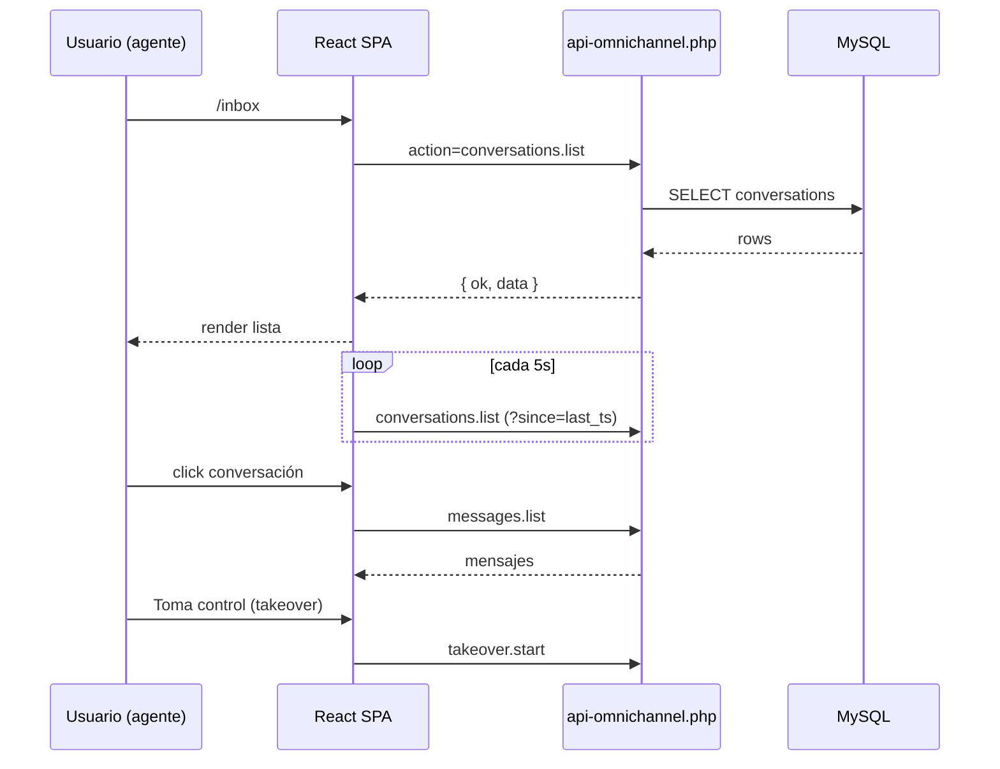

# 06 — Portal OmniCliente (Frontend React)

> **Ubicación fuente:** `client-portal-omnichannel/`
> **Build deployado:** `omnicliente/` (servido por WordPress en `/omnicliente/`)
> **Stack:** React 19.1.0 + Vite 6.3.5 + Tailwind 3.4.17

---

## 🎯 Propósito

SPA que provee:

1. **Inbox omnicanal** para agentes (WhatsApp/IG/TG/Messenger en una sola UI).
2. **Backoffice admin** para configurar bots, prompts, agentes, vault, ver analytics.
3. **Vista cliente** (de cara al cliente del SaaS) para ver sus conversaciones, propuestas, contratos.

---

## 📦 Dependencias clave (`package.json`)

| Paquete | Versión | Uso |
|---------|---------|-----|
| `react` | 19.1.0 | UI |
| `react-dom` | 19.1.0 | |
| `react-router-dom` | 6.x | Routing |
| `vite` | 6.3.5 | Bundler |
| `tailwindcss` | 3.4.17 | Estilos |
| `axios` (o `fetch` nativo) | — | HTTP (ver `api.js`) |
| `lucide-react` | — | Iconos |
| (otros: dayjs, classnames, etc.) | | |

---

## 🗂️ Estructura `src/`

```
src/
├── main.jsx                    # Entry
├── App.jsx                     # Router + AuthProvider
├── api.js                      # Cliente HTTP (370 líneas, 60+ endpoints)
├── auth/                       # Context + hooks de auth (3 modos)
├── components/                 # 25+ componentes
│   ├── InboxView.jsx           # Lista de conversaciones (polling 5s)
│   ├── ConversationDetail.jsx  # Hilo de mensajes
│   ├── ChatBubble.jsx          # Burbuja de mensaje
│   ├── MessageComposer.jsx     # Input + adjuntos
│   ├── AgentLogin.jsx          # Login agente
│   ├── ClientLogin.jsx         # Validar X-API-Key
│   ├── AdminDashboard.jsx      # Métricas + accesos
│   ├── BotConfigPanel.jsx      # Editor de configuración bot
│   ├── PromptsManager.jsx      # CRUD prompts
│   ├── AgentsManager.jsx       # CRUD agentes
│   ├── ChannelsManager.jsx     # CRUD canales
│   ├── VaultManager.jsx        # CRUD secretos
│   ├── N8NWorkflowsView.jsx    # Catálogo workflows
│   ├── N8NErrorsLog.jsx        # Errores reportados
│   ├── AIUsagePanel.jsx        # Costos OpenAI
│   ├── TakeoverButton.jsx      # Toma/suelta conversación
│   ├── ThemeToggle.jsx         # Dark/light
│   ├── Sidebar.jsx             # Nav lateral
│   ├── TopBar.jsx              # Header
│   ├── Toast.jsx, Modal.jsx, Spinner.jsx, EmptyState.jsx (UI primitives)
│   └── ... (otros)
├── hooks/                      # useAuth, usePolling, useToast, etc.
├── utils/                      # formatters, date, validators
└── styles/                     # Tailwind config + CSS globales
```

---

## 🔌 `src/api.js` (370 líneas)

Cliente HTTP unificado. Patrón:

```js
const callApi = async (action, body = {}, options = {}) => {
  const headers = { 'Content-Type': 'application/json' };
  const apiKey = localStorage.getItem('omni_api_key');
  const adminToken = localStorage.getItem('omni_admin_token');
  const agentToken = localStorage.getItem('omni_agent_token');
  if (apiKey) headers['X-API-Key'] = apiKey;
  if (adminToken) headers['X-Admin-Token'] = adminToken;
  if (agentToken) headers['X-Agent-Token'] = agentToken;
  // ... POST a api-omnichannel.php?action=<action>
};
```

Exporta funciones tipadas para cada acción del backend (ver `05_API_BACKEND_PHP.md`):

| Función | Acción backend |
|---------|----------------|
| `loginAgent(email, pass)` | `auth.agent_login` |
| `logoutAgent()` | `auth.agent_logout` |
| `validateClient()` | `auth.client_validate` |
| `listConversations(filters)` | `conversations.list` |
| `getConversation(id)` | `conversations.get` |
| `listMessages(convId, page)` | `messages.list` |
| `sendMessage(convId, body, media)` | `messages.send` |
| `markRead(convId)` | `messages.mark_read` |
| `startTakeover(convId)` | `takeover.start` |
| `endTakeover(convId)` | `takeover.end` |
| `getBotConfig(clientId)` | `bot.config.get` |
| `setBotConfig(clientId, config)` | `bot.config.set` |
| `listPrompts()` / `upsertPrompt()` | `prompts.*` |
| `listAgents()` / `createAgent()` / `toggleAgent()` | `agents.*` |
| `listVault()` / `setVaultSecret()` / `deleteVaultSecret()` | `vault.*` |
| `listN8nWorkflows()` / `listN8nErrors()` | `n8n.*` |
| `aiUsageSummary(month)` | `ai_usage.summary` |
| `dashboardStats()` | `analytics.dashboard` |
| (... 60+ funciones) | |

---

## 💾 LocalStorage keys

| Key | Propósito |
|-----|-----------|
| `omni_api_key` | X-API-Key del cliente |
| `omni_admin_token` | Token admin |
| `omni_agent_token` | Token de agente (post-login) |
| `omni_agent_data` | JSON con datos del agente logueado (id, name, role) |
| `omni_theme` | `dark` / `light` |
| `omni_ai_chats` | Cache local de chats con IA (modo asistente) |

---

## 🔄 Vistas y flujos

### Inbox (agente)



### Login agente

1. `AgentLogin` → `loginAgent(email, pass)` → backend valida bcrypt → devuelve `agent_token` + `agent_data`.
2. SPA persiste en `localStorage`.
3. Redirect a `/inbox`.

### Modo cliente (X-API-Key)

1. Cliente recibe URL: `https://automatizatech.cl/omnicliente/?key=ABC123`.
2. SPA detecta `?key=`, persiste en `localStorage` y limpia URL.
3. Llama `validateClient()` para confirmar.

### Modo admin

1. Admin entra desde menú backoffice WP (`Contactos > Portal OmniCliente`).
2. WordPress inyecta `X-Admin-Token` en URL temporal o cookie.
3. SPA persiste y desbloquea vistas admin.

---

## 🏗️ Build & deploy

```powershell
cd client-portal-omnichannel
npm install
npm run build
# Output va a dist/
# Copiar dist/* a ../omnicliente/
Copy-Item -Path .\dist\* -Destination ..\omnicliente\ -Recurse -Force
```

> Existe `tools/regen-portal-build.ps1` que automatiza este proceso.
> El `omnicliente/` debe quedar accesible en `https://automatizatech.cl/omnicliente/`.

---

## ⚠️ Quirks importantes

1. **Polling cada 5 s en `InboxView`** — considerar migrar a SSE/WebSockets para reducir carga.
2. **3 tokens en localStorage** — auditar limpieza al hacer logout.
3. **No hay refresh token** — si el `agent_token` expira, el agente debe relogearse.
4. **`omni_ai_chats` puede crecer** — implementar TTL/limpieza.
5. **Sin tests automatizados** — pendiente añadir Vitest/Playwright.
6. **`omnicliente/` (build) está commiteado al repo** — considerar `.gitignore` + pipeline CI.
