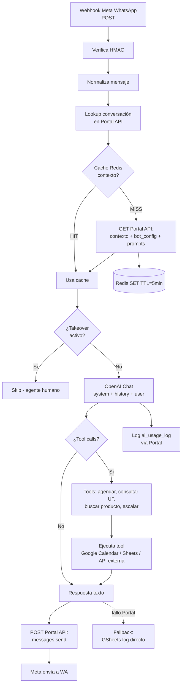

# 07 — N8N Workflows

> **Instancia:** `https://n8n-n8n.kchiba.easypanel.host` (Easypanel self-hosted)
> **Total workflows:** ~63 (38 PROD + 14 TEMPLATES + 11 raíz/legacy)
> **Backups:** `N8N/PROD/`, `N8N/TEMPLATES/kellscapilar/`, `N8N/` (raíz)

---

## 🗂️ Organización

```
N8N/
├── PROD/                                          # 38 workflows productivos
├── TEMPLATES/
│   ├── kellscapilar/                              # 8 plantillas (cliente piloto)
│   │   └── WhatsApp_Bot_v8_Portal_OmniCliente.json   # 🌟 Bot principal activo
│   └── (6 plantillas genéricas)
└── (11 workflows en raíz: históricos / sandbox)
```

---

## 🌟 Bot principal: `WhatsApp_Bot_v8_Portal_OmniCliente.json`

**Versión activa.** Diferencia vs v1–v7: lee del **Portal API** (no Google Sheets) con cache Redis 5 min y fallback a GSheets.

### Flujo simplificado



### Nodos clave

- **Webhook trigger** — endpoint `https://n8n-n8n.kchiba.easypanel.host/webhook/becd5a16-7b3a-4961-8a2c-e86ca01d069e`
- **HTTP Request** (Portal API) — auth con `X-Admin-Token` (env `OMNI_ADMIN_SECRET`)
- **Redis** — credential `fgxjc2NeBOcUCA3v`
- **OpenAI Chat Model** — credential `g52IEXpRfN5r7jKw`
- **Google Calendar** — credential `NrhQQuWgel9eWwzp`
- **Google Sheets** (fallback) — credential `xWQj9WmGzqGKwQtb`

---

## 📋 Catálogo de workflows productivos (selección)

| Workflow | Trigger | Propósito |
|----------|---------|-----------|
| `WhatsApp_Bot_v8_Portal_OmniCliente` | Webhook Meta | Bot conversacional principal |
| `Instagram_Bot_v3` | Webhook Meta IG | Bot Instagram DM |
| `Telegram_Bot_v2` | Webhook Telegram | Bot Telegram |
| `Messenger_Bot_v2` | Webhook Meta FB | Bot Messenger |
| `YCloud_Receiver` | Webhook YCloud | Recibe WA via YCloud BSP |
| `Lead_To_CRM` | Webhook AT | Inserta lead en BD desde forms externos |
| `Appointment_Booking` | HTTP / Tool | Agenda cita en Google Calendar + Meet |
| `Appointment_Reminder_24h` | Cron diario | Envía recordatorio 24h antes |
| `Appointment_Reminder_1h` | Cron horario | Recordatorio 1h antes |
| `Proposal_Sent_Notify` | Webhook AT | Notifica equipo cuando propuesta enviada |
| `Proposal_Accepted_To_Contract` | Webhook AT | Genera contrato al aceptar propuesta |
| `Contract_Signed_Internal_Notify` | Webhook AT | Notifica firma interna |
| `Contract_Signed_Final_Email` | Webhook AT | Envía PDF final al cliente |
| `Daily_Stats_Digest` | Cron 8 AM | Resumen diario al equipo |
| `UF_Refresh` | Cron diario | Refresca UF/USD desde mindicador.cl |
| `OpenAI_Cost_Alert` | Cron diario | Alerta si costos > umbral |
| `N8N_Error_To_AT` | Error Trigger | Reporta errores a `wp_omnichannel_n8n_errors` |
| `Vault_Health_Check` | Cron horario | Valida que el vault responde |
| `Inbox_Stale_Conversations` | Cron diario | Marca conversaciones sin respuesta >X días |
| `Bot_Template_Sync` | Webhook AT | Sincroniza templates de bot |
| `Backup_Workflows_Nightly` | Cron 3 AM | Exporta workflows vía API N8N |
| (otros 17+ en PROD/) | | |

> **Para agregar uno nuevo:** crear workflow en N8N UI, exportar JSON, guardarlo en `N8N/PROD/`, registrar en `wp_omnichannel_n8n_workflows`, documentar fila aquí.

---

## 🔑 Credenciales N8N (IDs)

| Credencial | ID | Uso |
|-----------|-----|-----|
| OpenAI | `g52IEXpRfN5r7jKw` | Bot, embeddings |
| Google Sheets | `xWQj9WmGzqGKwQtb` | Logs fallback, lectura catálogos |
| Google Calendar | `NrhQQuWgel9eWwzp` | Agendamiento + Meet |
| Meta WhatsApp Cloud | `TVTLZP26kDJjR0KP` | Envío WA via Meta |
| YCloud | `cDHuTtbqeib255B5` | Envío WA via YCloud BSP |
| Redis | `fgxjc2NeBOcUCA3v` | Cache contexto bot (TTL 5 min) |
| Telegram | `nFQXlS5PE97ruk0W` | Bot Telegram |
| HTTP Header Auth (Portal AT) | (variable, usa env) | `OMNI_ADMIN_SECRET` |

---

## 🌐 Variables de entorno N8N requeridas

| Variable | Valor | Notas |
|----------|-------|-------|
| `OMNI_ADMIN_SECRET` | (secret) | Para `X-Admin-Token` en llamadas a Portal API |
| `AT_BASE_URL` | `https://automatizatech.cl` | Base de llamadas a backend AT |
| `AT_WEBHOOK_SECRET` | (secret) | HMAC para `at_webhook_verify_hmac` (lado AT) |
| `OPENAI_DEFAULT_MODEL` | `gpt-4o-mini` | Modelo por defecto |
| `REDIS_TTL_BOT_CONTEXT` | `300` | TTL en segundos |

---

## 🔁 Patrones de integración con backend AT

### N8N → AT (outbound)

- Endpoint: `https://automatizatech.cl/api-omnichannel.php?action=<accion>`
- Headers: `X-Admin-Token: $OMNI_ADMIN_SECRET`, `Content-Type: application/json`
- Para webhooks WP (`/wp-json/automatiza-tech/v1/n8n/error`): adicional `X-AT-Signature` + `X-AT-Timestamp` (HMAC-SHA256).

### AT → N8N (inbound trigger)

- AT invoca webhook N8N (URL específica del workflow).
- Payload firmado con HMAC-SHA256, header `X-AT-Signature`.
- N8N node "HMAC verify" valida; si falla → 401.

---

## ⚠️ Quirks y mantenimiento

1. **30+ versiones del bot WhatsApp (v1–v8)** en `TEMPLATES/kellscapilar/` — mantener solo v8 + v7 backup.
2. **N8N único compartido prod/dev** — para dev usar duplicados con sufijo `_DEV`.
3. **Workflows en `N8N/` raíz** son legacy/sandbox — mover a `PROD/` o eliminar.
4. **Redis es crítico** para latencia del bot — monitorear health (workflow `Vault_Health_Check` puede extenderse).
5. **Backups manuales** vía `Backup_Workflows_Nightly`; verificar que estén llegando a S3/GDrive si configurado.
6. **Errores N8N** terminan en `wp_omnichannel_n8n_errors` — revisar semanal en Portal.
