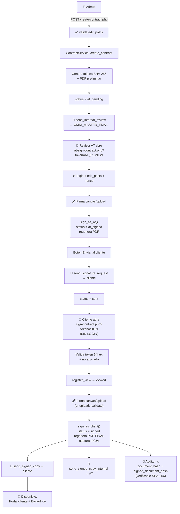

# 09 — Módulo de Contratos (Firma Electrónica Doble)

> **Ubicación:** `contracts/`
> **Tabla principal:** `wp_automatiza_contracts`
> **Características:** doble firma (AT interna + cliente externo), tokens 64-hex, hashes SHA-256, captura IP/UA, auditoría completa.

---

## 🗄️ Schema `wp_automatiza_contracts`

| Campo | Tipo | Propósito |
|-------|------|-----------|
| `id` | BIGINT PK | |
| `client_id`, `project_id`, `proposal_id` | BIGINT | FKs a otros módulos |
| `contract_number` | VARCHAR(40) | `AT-CTR-YYYYMMDD-XXXXX` |
| `type` | ENUM | `soporte`, `servicios`, `sla`, `nda`, `handover` |
| `template_id` | VARCHAR(80) | Default `soporte_v2` |
| `placeholders` | LONGTEXT JSON | Datos dinámicos del template |
| `pdf_url` | VARCHAR(500) | PDF preliminar (sin firmas) |
| `signed_pdf_url` | VARCHAR(500) | PDF final (ambas firmas) |
| `status` | ENUM | `draft → at_pending → at_signed → sent → viewed → signed` |
| `sign_token` | CHAR(64) | Token público cliente (SHA-256 hex) |
| `at_review_token` | CHAR(64) | Token interno revisor AT |
| `document_hash` | CHAR(64) | SHA-256 del PDF preliminar |
| `signed_document_hash` | CHAR(64) | SHA-256 del PDF final |
| `at_signer_*` | VARCHAR | Firma AT: name, rut, email, ip, signed_at, method, image_url |
| `signer_*` | VARCHAR | Firma cliente: name, rut, email, ip, user_agent, method, image_url, signed_at |
| `starts_at`, `ends_at` | DATE | Vigencia |
| `monthly_amount`, `currency` | DECIMAL, CHAR(3) | Valor (CLP/USD) |
| `expires_at` | DATETIME | Expiración del link (default 14 días) |
| `created_by`, `created_at`, `updated_at` | BIGINT, DATETIME | Auditoría |

---

## 📁 Archivos del módulo

| Archivo | Tipo | Acceso |
|---------|------|--------|
| `setup-contracts-db.php` | Setup tabla | GET `?key=AT_SETUP_2026` |
| `contract-service.php` | Clase `ContractService` | Interno |
| `contract-mailer.php` | Clase `ContractMailer` | Interno |
| `create-contract.php` | API POST | Logged + `edit_posts` |
| `at-sign-contract.php` | UI firma interna | Logged + `edit_posts` + nonce |
| `sign-contract.php` | UI firma cliente | Público con token 64-hex |
| `admin-contracts.php` | Backoffice WP | `manage_options` |
| `client-contracts-widget.php` | Widget ficha cliente | `edit_posts` |

---

## 🛠️ API `ContractService` (métodos públicos)

| Método | Input | Output | Estado resultante |
|--------|-------|--------|-------------------|
| `create_contract($args)` | client_id, type, placeholders | object | `at_pending` |
| `sign_as_at($id, $data)` | firma representante AT | object | `at_signed` |
| `send_for_client_signature($id, $email)` | id, email | bool / WP_Error | `sent` |
| `register_view($token)` | sign_token | bool | `viewed` (si era `sent`) |
| `sign_as_client($token, $data)` | sign_token + datos firma | object | `signed` |
| `get_by_id($id)` | id | object | — |
| `get_by_token($token)` | sign_token | object | — |
| `get_by_at_token($token)` | at_review_token | object | — |
| `list_by_client($client_id)` | client_id | array | — |

### Almacenamiento de PDFs y firmas

```
/wp-content/uploads/automatiza-tech-contracts/
├── .htaccess                # Deny all
├── PDFs (preliminar y final)
└── signatures/              # PNG/JPG firmas
```

---

## 📨 `ContractMailer` (4 correos)

| Método | Destinatario | Trigger | Adjunto |
|--------|--------------|---------|---------|
| `send_internal_review()` | `OMNI_MASTER_EMAIL` | Crear contrato (draft) | PDF preliminar |
| `send_signature_request()` | Cliente | Tras firma AT | PDF firmado AT |
| `send_signed_copy()` | Cliente | Tras firma cliente | PDF FINAL |
| `send_signed_copy_internal()` | `OMNI_MASTER_EMAIL` | Tras firma cliente | PDF FINAL |

Headers: `Content-Type: text/html`, `From: contacto@automatizatech.cl`. Templates branded.

---

## 🔄 Flujo end-to-end



---

## 🔐 Validaciones críticas

### `sign-contract.php` (público)

- ✅ Token 64-hex: `preg_match('/^[a-f0-9]{64}$/', $token)`
- ✅ Contrato no expirado (`expires_at`)
- ✅ Estado != `signed` (no doble firma)
- ✅ Checkbox "acepto términos" obligatorio
- ✅ Imagen firma: `getimagesize()`, MIME PNG/JPG, ≤2 MB (`at_validate_upload`)
- ✅ Sanitización: `sanitize_text_field`, `sanitize_email`

### `at-sign-contract.php` (interno)

- ✅ `is_user_logged_in()` + `current_user_can('edit_posts')`
- ✅ `wp_verify_nonce()` en POST
- ✅ Mismo set de validaciones de imagen

### `admin-contracts.php`

- ✅ `current_user_can('manage_options')`
- ✅ `check_admin_referer('at_contract_action')`

---

## 🔗 Integraciones

| Sistema | Integración |
|---------|-------------|
| CRM | FK `client_id` → `wp_automatiza_tech_clients` |
| Propuestas | FK `proposal_id` → `wp_automatiza_proposals` (auto-genera contrato al aceptar) |
| Backoffice AutomatizaTech | PDF disponible en `/wp-content/uploads/automatiza-tech-contracts/` — acceso vía backoffice WP, **no** desde Portal OmniCliente |
| N8N | Workflows `Contract_Signed_*` notifican equipo |
| Email | SMTP corporativo |

---

## 📋 Convenciones

- **Numeración:** `AT-CTR-YYYYMMDD-XXXXX` (5 dígitos random alfanum).
- **Plantillas:** Markdown en `/Docs/CONTRATO_*.md`, renderizadas a HTML → DOMPDF (o equivalente).
- **Idioma:** Español (Chile, RUT como identificador).
- **Vigencia link:** 14 días por defecto, configurable.
- **Doble copia:** Siempre se envía al cliente Y al `OMNI_MASTER_EMAIL` interno.

---

## ⚠️ Pendientes / mejoras

1. Implementar firma con **certificado digital** (eIDAS / FEA) — actualmente es firma simple (canvas).
2. **Audit log dedicado** — tabla `wp_automatiza_contract_events` (ya existe, validar uso completo).
3. **Recordatorios automáticos** si cliente no firma en X días (cron N8N).
4. **API de revocación** — endpoint para cancelar contrato firmado (con razón).
5. **Versionado de templates** — guardar versión exacta del template usado al crear.
