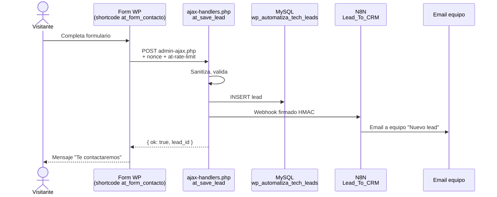
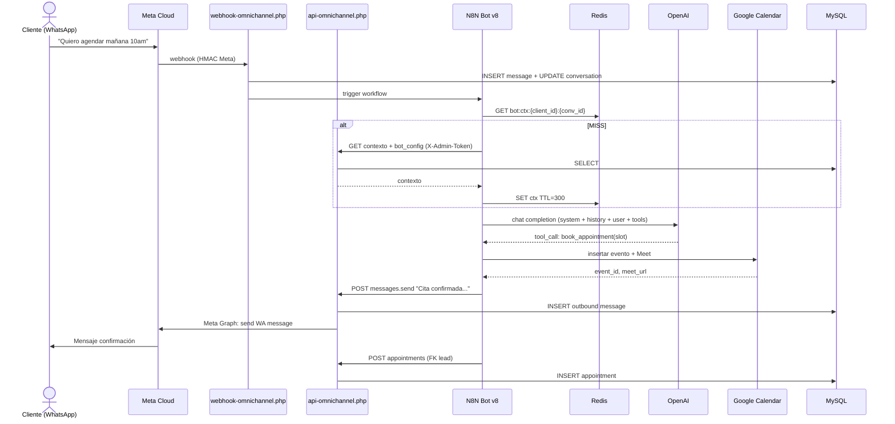
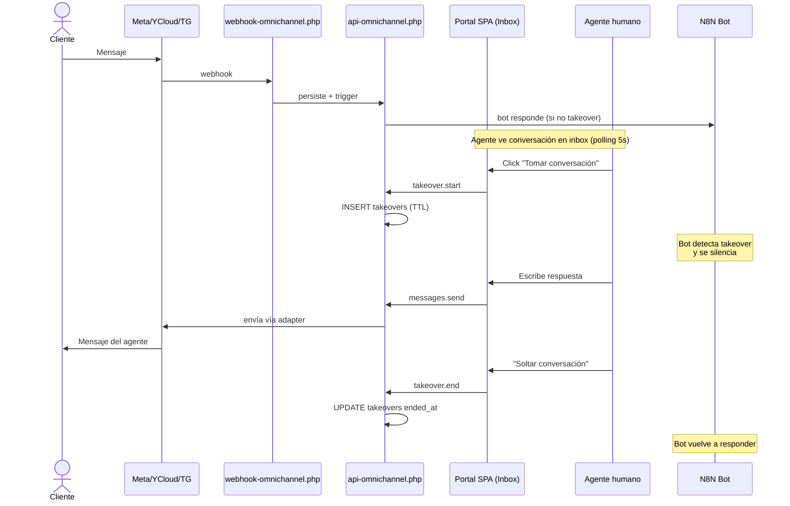
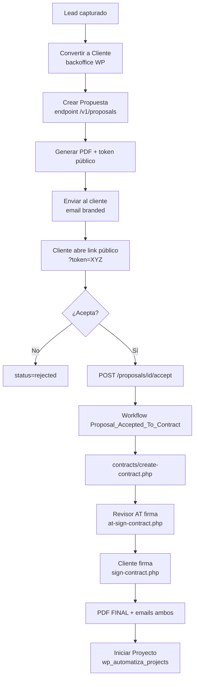
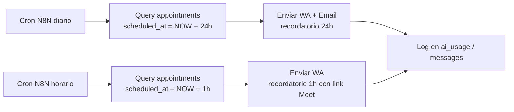
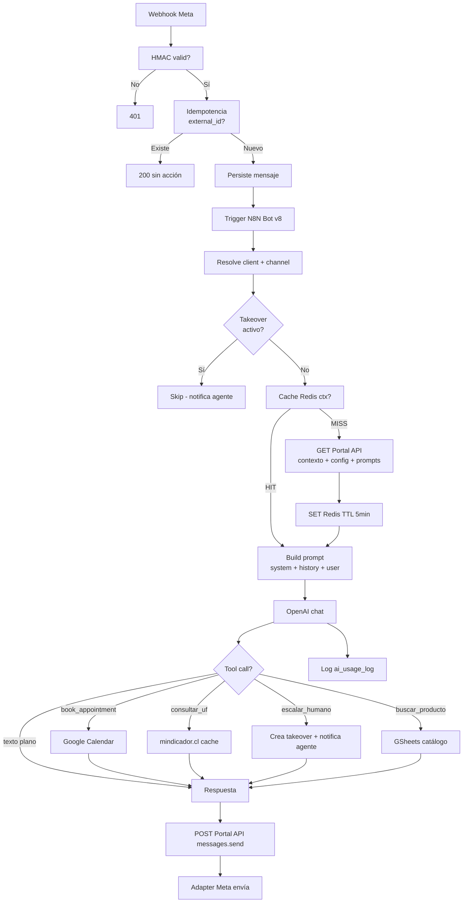
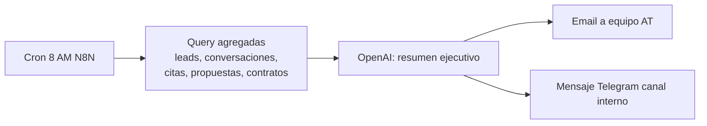
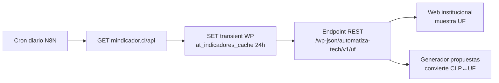
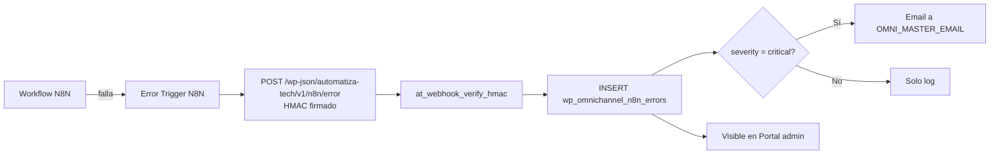

# 12 — Flujos de Negocio (Diagramas Mermaid)

> Diagramas end-to-end de los procesos críticos del ecosistema. Cada flujo cruza múltiples subsistemas (theme WP, API PHP, N8N, Portal, integraciones).

---

## 1. 🎯 Captura de lead web

---

## 2. 📅 Agendamiento de cita (vía bot WhatsApp)

---

## 3. 🔁 Conversación omnicanal con takeover de agente

---

## 4. 💼 Pipeline comercial: lead → propuesta → contrato

---

## 5. ⏰ Recordatorios automáticos de cita

---

## 6. 🔐 Bot WhatsApp v8 — flujo interno detallado

---

## 7. ✍️ Firma electrónica de contrato (doble)

Ver `09_MODULO_CONTRATOS.md` (diagrama completo).

---

## 8. 📊 Generación de digest diario

---

## 9. 🔄 Sincronización de UF / indicadores

---

## 10. 🚨 Reporte de errores N8N → AT

