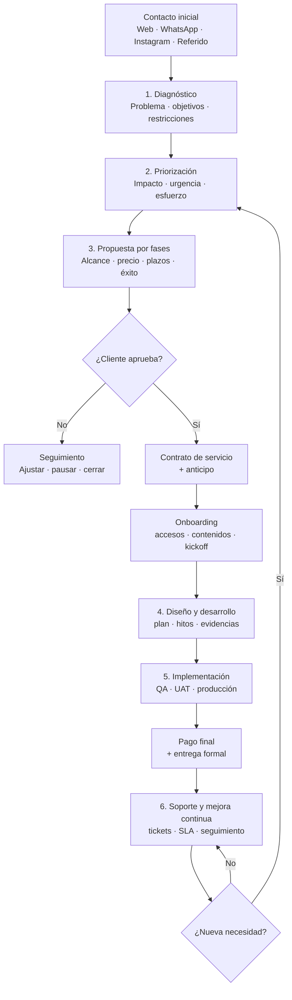
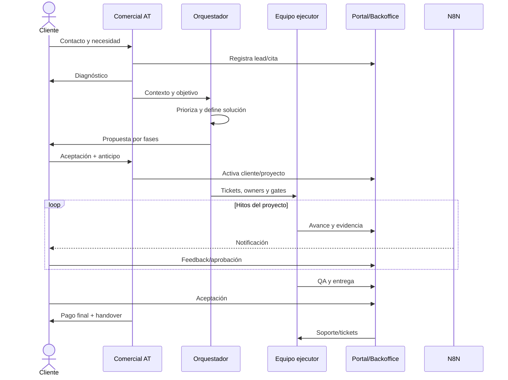

# Aplicación del Método AutomatizaTech

## Objetivo

El Método AT transforma un contacto comercial en una solución entregada, medible y soportada. Mantiene seis pasos visibles para el cliente y un ciclo interno más detallado para ventas, arquitectura, ejecución, QA y soporte.

## Flujo macro

## Los seis pasos

### 1. Diagnóstico

**Pregunta:** ¿Qué problema de negocio existe y qué resultado espera el cliente?

Actividades:

- Capturar origen del lead y antecedentes.
- Reunión de 15–60 minutos según complejidad.
- Identificar usuarios, proceso actual, datos, herramientas y restricciones.
- Definir síntomas, impacto y urgencia.
- Evitar recomendar tecnología antes de entender el problema.

Entregable: resumen diagnóstico y lista de información pendiente.

Gate: problema, usuario y resultado esperado comprensibles.

### 2. Priorización

**Pregunta:** ¿Qué conviene resolver primero?

Actividades:

- Separar quick wins, núcleo y futuras fases.
- Evaluar impacto, esfuerzo, riesgo y dependencias.
- Elegir servicio o combinación de servicios usando `SERVICIOS_Y_CASOS_DE_USO.md`.
- Definir MVP cuando corresponda.

Entregable: roadmap por fases y recomendación AT.

Gate: Luis y cliente comprenden prioridades y exclusiones.

### 3. Propuesta por fases

**Pregunta:** ¿Qué se hará, cuánto cuesta, cuánto demora y cómo se acepta?

La propuesta incluye:

- Objetivo y situación actual.
- Alcance por fase.
- Entregables y exclusiones.
- Dependencias del cliente.
- Precio, forma de pago y validez.
- Fechas o rangos estimados.
- Criterios de aceptación.
- Soporte incluido y opciones posteriores.

Gate: propuesta aceptada, contrato de servicios y anticipo confirmado.

### 4. Diseño y desarrollo

**Pregunta:** ¿Cómo se convierte la propuesta en una solución usable?

Actividades comunes:

- Kickoff y checklist de onboarding.
- Arquitectura/prototipo según clase del proyecto.
- Hitos con owner, fecha y evidencia.
- Demos y decisiones registradas.
- Gestión de cambios de alcance.
- Ejecución bajo `Docs/ENGINEERING_STANDARDS/`.

Gate: entregables de desarrollo completos y listos para QA/UAT.

### 5. Implementación y entrega

**Pregunta:** ¿La solución funciona, está aceptada y puede operarse con seguridad?

Actividades:

- QA técnico y de negocio.
- UAT o validación del cliente.
- Correcciones de aceptación.
- Plan de deploy/migración y rollback.
- Capacitación y documentación.
- Puesta en producción controlada.
- Pago final y acta/handover.

Gate: aceptación registrada, evidencias, documentación y siguiente owner.

### 6. Soporte y mejora continua

**Pregunta:** ¿Cómo se mantiene estable y evoluciona la solución?

Actividades:

- Tickets e incidentes por prioridad.
- Monitoreo, backups, actualizaciones y costos.
- Optimización de prompts, conversiones o procesos.
- Reporte y reunión de seguimiento.
- CSAT/NPS cuando aplique.
- Nuevas fases vuelven a priorización.

Gate permanente: todo ticket tiene owner, SLA/fecha, estado y evidencia de cierre.

## Responsabilidades por etapa

| Etapa | Cliente | Luis/AT | Orquestador | Ejecutor | Sistema/Portal |
|---|---|---|---|---|---|
| Diagnóstico | Explica problema y entrega datos | Lidera relación | Ordena contexto | Investiga si se delega | Registra lead/cita |
| Priorización | Valida impacto | Decide recomendación | Diseña alternativas | Estima factibilidad | Guarda roadmap/ticket |
| Propuesta | Acepta o solicita cambios | Define comercial | Verifica coherencia | Genera artefactos | Propuesta/contrato |
| Desarrollo | Entrega insumos y feedback | Gestiona expectativas | Divide tickets y gates | Implementa/prueba | Hitos/evidencias |
| Entrega | Ejecuta UAT y acepta | Autoriza cierre/deploy | Revisa evidencia | Corrige y documenta | QA/handover/pago |
| Soporte | Reporta y valida | Prioriza/escalamiento | Asigna/revisa | Resuelve | Tickets/SLA/reportes |

## Ciclo operativo con Portal y automatizaciones

El Portal no es obligatorio como producto para todos, pero puede ser una capa transversal de transparencia cuando exista la funcionalidad correspondiente.

## Control de cambios

Una solicitud del cliente se clasifica como:

- **Corrección:** incumple el criterio acordado; pertenece al alcance.
- **Ajuste menor:** cambio reversible de bajo esfuerzo; se registra y prioriza.
- **Cambio de alcance:** nuevo módulo, integración, usuario o resultado; requiere estimación y aprobación.
- **Nueva fase:** vuelve a priorización y propuesta.

## Contratos recomendados

1. Contrato de prestación del proyecto después de aceptar la propuesta y antes de desarrollar.
2. Acta de entrega/handover al aprobar QA y pago final.
3. Contrato o SLA de soporte para continuidad, mantenimiento y mejoras.

## Métricas del Método AT

- Tiempo contacto → diagnóstico.
- Tiempo diagnóstico → propuesta.
- Tasa de aceptación.
- Tiempo propuesta → anticipo.
- Hitos aprobados en fecha.
- Retrabajo por alcance ambiguo.
- Tiempo proyecto → entrega.
- Defectos posteriores a entrega.
- Cumplimiento de SLA.
- CSAT/NPS y renovación/expansión.

## Definition of Done del proyecto

- Criterios de aceptación cumplidos.
- QA/UAT con evidencia.
- Deploy o entrega reproducible.
- Documentación y capacitación entregadas.
- Pago/contrato/acta según corresponda.
- Soporte y owner posterior definidos.
- Vault, Graphify y memoria actualizados.
- Cliente conoce canales, alcance de soporte y próximos pasos.
