# Servicios AutomatizaTech — Casos de uso y aplicación del Método AT

## Posicionamiento

AutomatizaTech no vende piezas sueltas: diagnostica el problema y combina marketing, software, automatización e inteligencia artificial en un sistema coherente. El catálogo actual incluye sitios web premium, aplicaciones web, apps móviles, sistemas a medida, automatización, asistentes inteligentes, Portal OmniCliente, marketing digital y asesoría tecnológica.

## Árbol de decisión

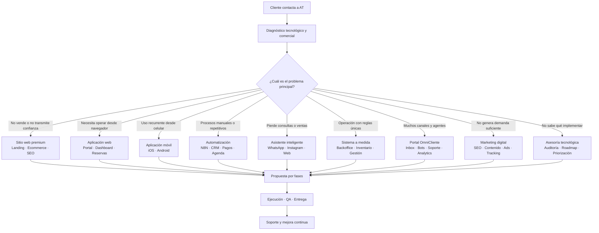

## Resumen de casos

| Servicio | Cliente/caso típico | Resultado de negocio | KPI principal |
|---|---|---|---|
| Sitio web premium | Clínica, estudio, profesional, empresa B2B | Confianza y captación | Leads/conversión |
| Ecommerce | Tienda física o catálogo por WhatsApp | Venta digital integrada | Ventas/ticket promedio |
| Aplicación web | Operación basada en Excel/WhatsApp | Centralización y trazabilidad | Tiempo/error por proceso |
| Aplicación móvil | Usuarios recurrentes o trabajo en terreno | Acceso, recurrencia y fidelización | Usuarios activos/retención |
| Sistema a medida | Reglas operacionales únicas | Control y escalabilidad | Productividad/costo operativo |
| Automatización | Copia manual entre herramientas | Menos trabajo repetitivo | Horas ahorradas/errores |
| Asistente IA | Consultas y ventas fuera de horario | Respuesta y conversión 24/7 | Resolución/conversión |
| Portal OmniCliente | Múltiples canales, bots y agentes | Atención organizada | SLA/tiempo de respuesta |
| Marketing digital | Buen servicio sin demanda estable | Leads medibles y crecimiento | CAC/ROAS/conversión |
| Asesoría tecnológica | Herramientas dispersas y prioridades confusas | Roadmap de inversión | Ahorro/impacto ejecutado |

## 1. Sitio web premium o a medida

**Ejemplo:** estudio fotográfico, clínica estética, spa, abogado, restaurante o empresa B2B.

**Problema:** sitio genérico, lento o inexistente; poca confianza y escasa conversión.

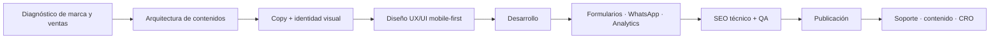

Entregables posibles:

- Diseño personalizado y responsive.
- Páginas de servicios, casos, equipo y contacto.
- Copy orientado a conversión.
- Formularios, WhatsApp y CRM.
- SEO técnico, schema y analytics.
- Hosting/deploy, capacitación y mantenimiento.

Soporte: seguridad, backups, contenido, SEO, conversiones y nuevas landings.

## 2. Ecommerce conectado

**Ejemplo:** tienda que hoy vende por Instagram/WhatsApp y controla stock manualmente.

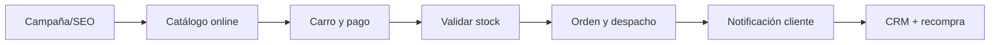

Entregables: catálogo, variantes, pagos, despacho, inventario, emails/WhatsApp, analítica e integración con backoffice.

Soporte: catálogo, pasarelas, seguridad, conciliación, campañas y optimización de checkout.

## 3. Aplicación web

**Ejemplo:** clínica o empresa que gestiona clientes, reservas, pagos y reportes en planillas.

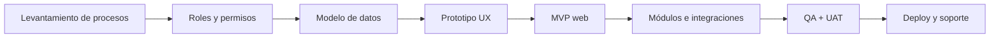

Módulos frecuentes: usuarios, clientes, agenda, pagos, documentos, notificaciones, dashboard, auditoría e integraciones.

La diferencia con un sitio es que la aplicación ejecuta procesos autenticados y guarda estado operacional.

## 4. Aplicación móvil

**Ejemplo:** gimnasio, centro médico, comunidad, comercio, fidelización o equipo en terreno.

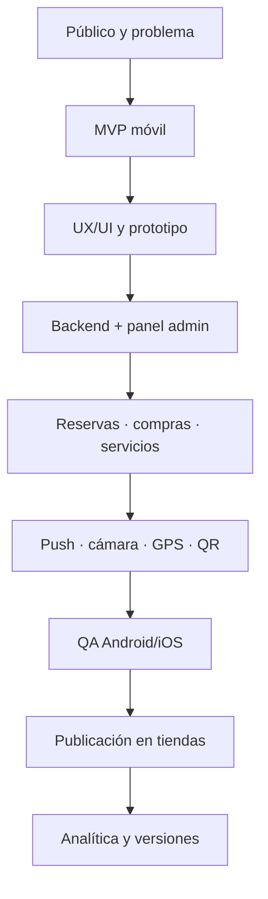

Casos: reservas, puntos, comunidad, seguimiento, notificaciones, pagos, contenido, cámara/GPS y trabajo offline.

Soporte: crashes, compatibilidad, stores, analítica, seguridad y nuevas versiones.

## 5. Sistema a medida

**Ejemplo:** distribuidora, operación logística, producción, órdenes o control interno con reglas que un SaaS genérico no cubre.

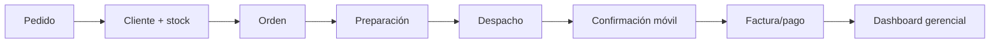

Puede incluir inventario, órdenes, proveedores, despacho, facturación, app de terreno, reportes, auditoría e integración ERP/CRM.

Gate especial: blueprint/ADR, MVP por fases, migración y rollback antes de construir el núcleo.

## 6. Automatización de negocios

**Ejemplo:** un equipo copia formularios a Excel, agenda manualmente y envía recordatorios uno a uno.

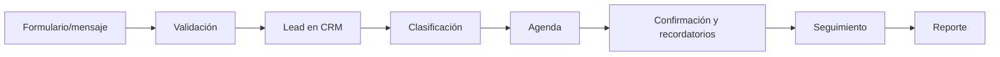

Automatizaciones frecuentes:

- Lead → CRM.
- WhatsApp → Calendar.
- Pago → factura.
- Venta → onboarding.
- Ticket → asignación/escalamiento.
- Cobranzas y recordatorios.
- Sincronización entre plataformas.
- Reportes diarios o ejecutivos.

Soporte: monitoreo de workflows, errores, cambios de proveedores, credenciales y métricas.

## 7. Asistente inteligente

**Ejemplo:** negocio que pierde consultas fuera de horario o repite respuestas todo el día.

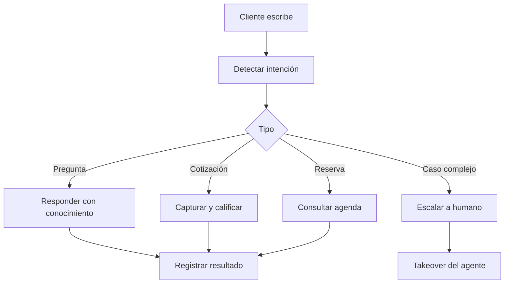

Canales: WhatsApp, Instagram, web, Telegram y Messenger.

Integraciones: Calendar, CRM, catálogo, pagos, inventario, N8N y Portal OmniCliente.

Soporte: precisión, prompts, base de conocimiento, herramientas, escalamiento y costo por conversación.

## 8. Portal OmniCliente

**Ejemplo:** empresa con varios canales, bots y ejecutivos que responden sin coordinación.

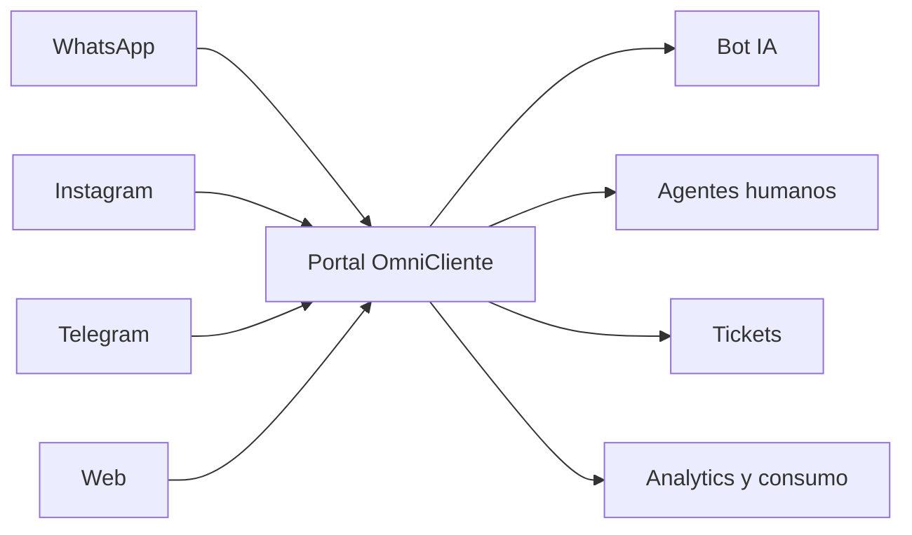

Casos: inbox, asignación, takeover, bots, prompts, agentes, vault, tickets, errores N8N, analytics y costos IA.

No todos los clientes necesitan comprar el Portal. Puede complementar otros servicios cuando resuelve atención, soporte u operación omnicanal.

## 9. Marketing digital y crecimiento

**Ejemplo:** negocio con buen producto pero sin flujo constante de prospectos.

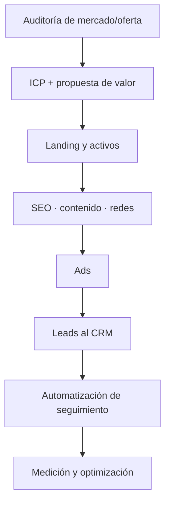

Servicios: estrategia, ICP, oferta, SEO, contenido, redes, reels/comerciales, Meta/Google Ads, landings, email/WhatsApp marketing, tracking y CRO.

La diferencia AT es conectar marketing con CRM, automatización, atención y ventas; el lead no termina abandonado en un formulario.

## 10. Asesoría y diagnóstico tecnológico

**Ejemplo:** pyme con muchas herramientas, costos, riesgos y prioridades poco claras.

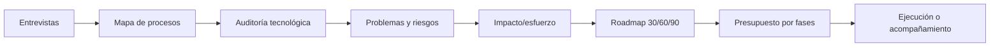

Entregables: diagnóstico ejecutivo, procesos, inventario tecnológico, riesgos, oportunidades, arquitectura, roadmap, presupuesto, proveedores y acompañamiento.

## Paquetes frecuentes

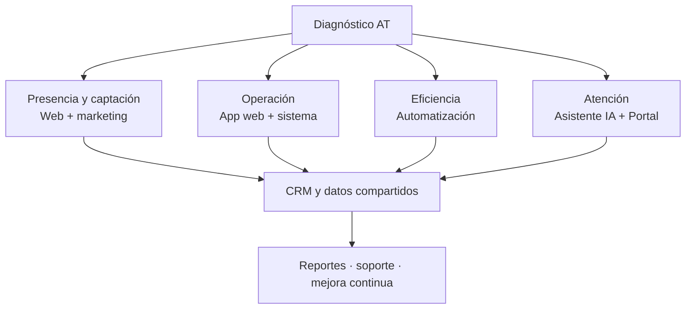

- Spa/clínica: sitio premium + marketing + asistente + agenda + CRM.
- Tienda: ecommerce + inventario + automatización + WhatsApp.
- Empresa de servicios: web + aplicación interna + portal de clientes.
- Operación en terreno: sistema web + app móvil + dashboard.
- Equipo de atención: asistente IA + Portal OmniCliente + tickets.
- Pyme desordenada: asesoría + roadmap + automatizaciones por fases.

## Aplicación del Método AT por servicio

| Servicio | Diagnóstico/prioridad | Diseño/desarrollo | QA/entrega | Soporte |
|---|---|---|---|---|
| Sitio/ecommerce | Marca, oferta, conversión | UX, copy, desarrollo | Responsive, SEO, formularios/pagos | Seguridad, contenido, CRO |
| App web/móvil | Usuarios y procesos | Prototipo, backend, módulos | Integración, UAT, stores/deploy | Bugs, analítica, versiones |
| Sistema a medida | Reglas y datos | Blueprint, MVP, migración | Seguridad, performance, rollback | Operación, evolución |
| Automatización | Proceso y excepciones | Workflow, credenciales, idempotencia | Casos reales y fallos | Monitoreo y proveedores |
| Asistente IA | Intenciones y conocimiento | Prompt, tools, canales | Precisión, escalamiento, costo | Tuning y base de conocimiento |
| Portal OmniCliente | Canales/equipo/SLA | Configuración e integraciones | Permisos, mensajes, takeover | Tickets, errores, consumo |
| Marketing | Oferta, ICP y medición | Activos, campañas, tracking | Eventos, atribución, calidad lead | Optimización mensual |
| Asesoría | Auditoría y objetivos | Roadmap y arquitectura | Validación ejecutiva | Acompañamiento |

## Regla comercial

AT recomienda primero la combinación mínima que resuelve el problema. Las capacidades adicionales se presentan como fases con impacto, costo, dependencias y criterios de éxito, no como tecnología agregada sin justificación.
