# 🔧 Diagrama Visual - Administrador Backend (Mermaid)

**Sistema AutomatizaTech - Panel Admin**  
**Versión:** 2.0

---

## 📊 Panel de Administración

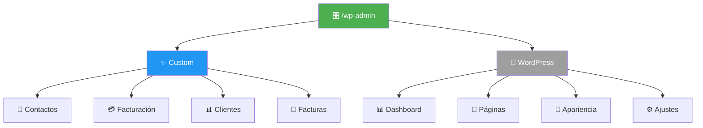

---

## 🔄 Flujo de Trabajo Admin

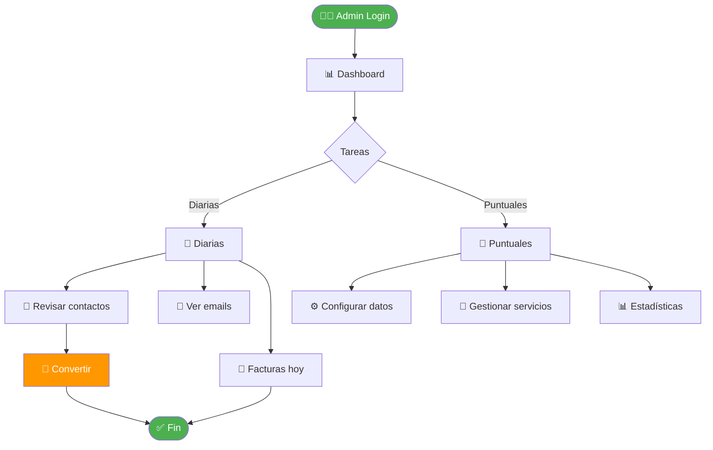

---

## 👥 Gestión de Contactos

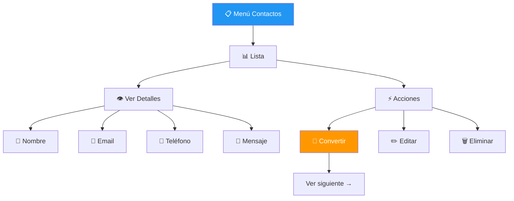

---

## 💳 Conversión: Contacto → Cliente

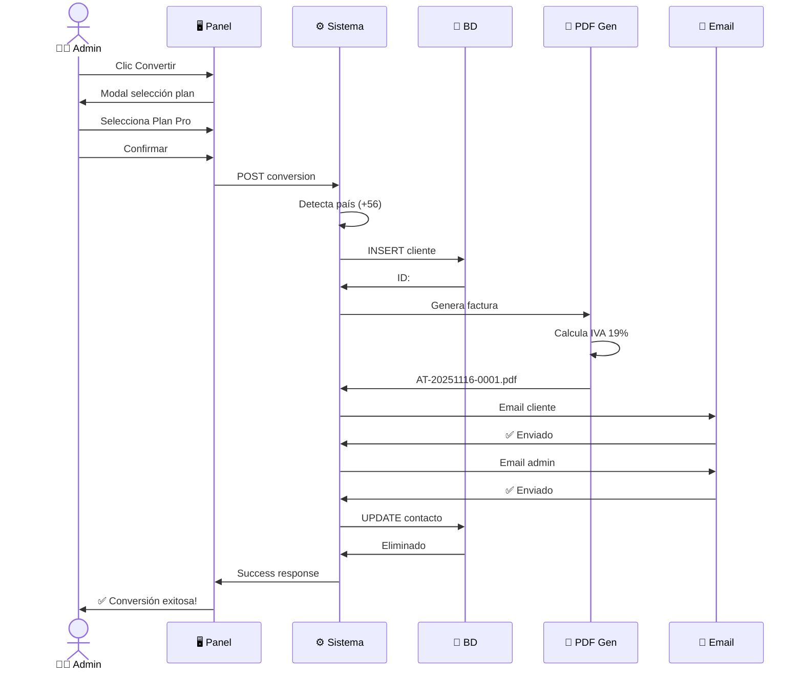

---

## ⚙️ Configurar Facturación

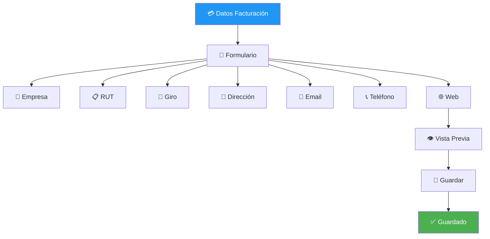

---

## 💼 Gestionar Servicios (BD)

```mermaid
graph TB
    DB[(💾 wp_automatiza_services)] --> Table[📊 Tabla]
    
    Table --> R1[1 | Plan Básico | 150K | 180]
    Table --> R2[2 | Plan Pro | 350K | 400]
    Table --> R3[3 | Plan Empresa | 650K | 750]
    Table --> R4[4 | Plan Premium | 950K | 1100]
    
    R1 --> Actions{Acciones}
    Actions -->|Agregar| Insert[INSERT]
    Actions -->|Actualizar| Update[UPDATE]
    Actions -->|Convertir| Calc[CLP/950=USD]
    
    style DB fill:#4CAF50,color:#fff
    style Insert fill:#2196F3,color:#fff
    style Update fill:#FF9800,color:#fff
```

---

## 📊 Estadísticas y Monitoreo

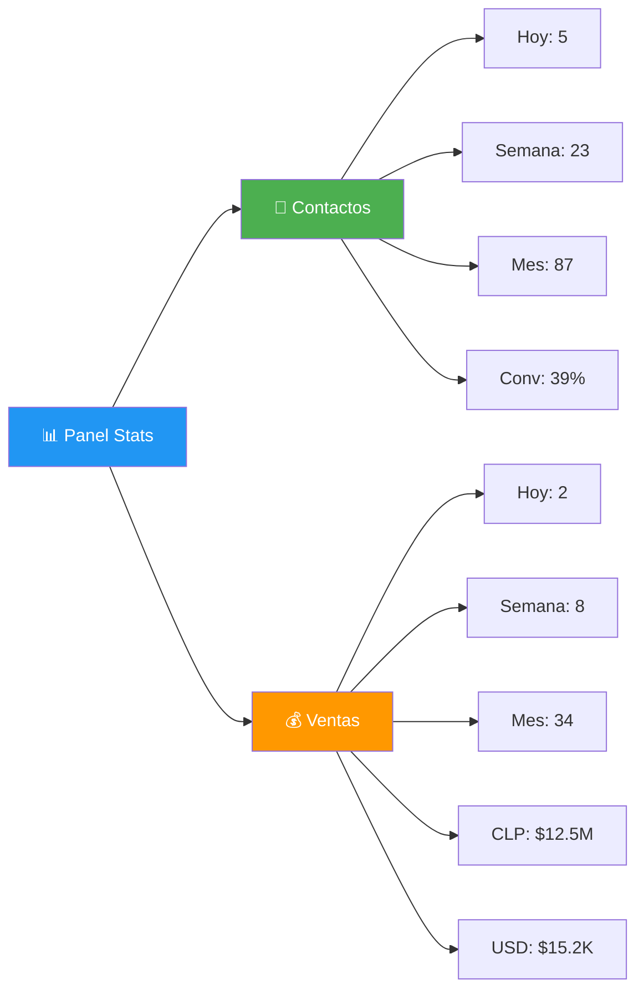

---

## 📧 Sistema Emails Admin

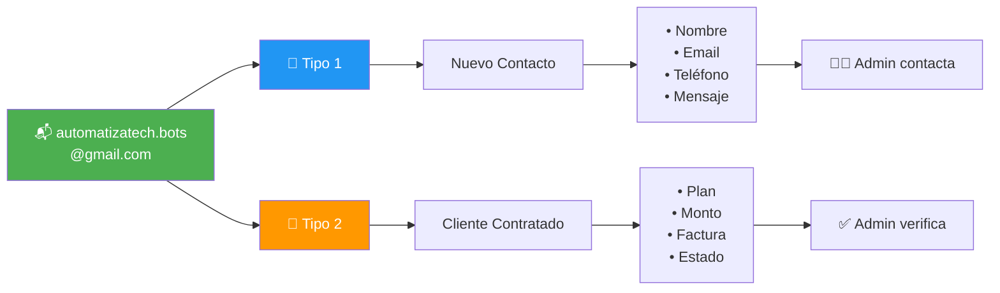

---

## 🔍 Acceso a Facturas

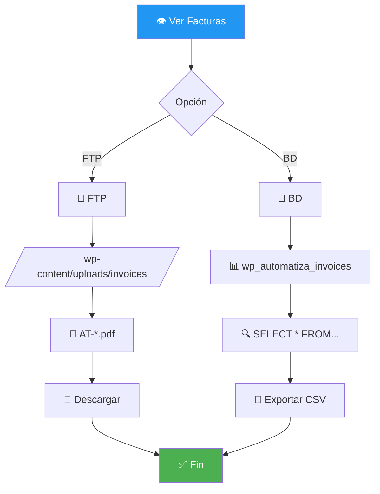

---

## 🛠️ Calendario Tareas

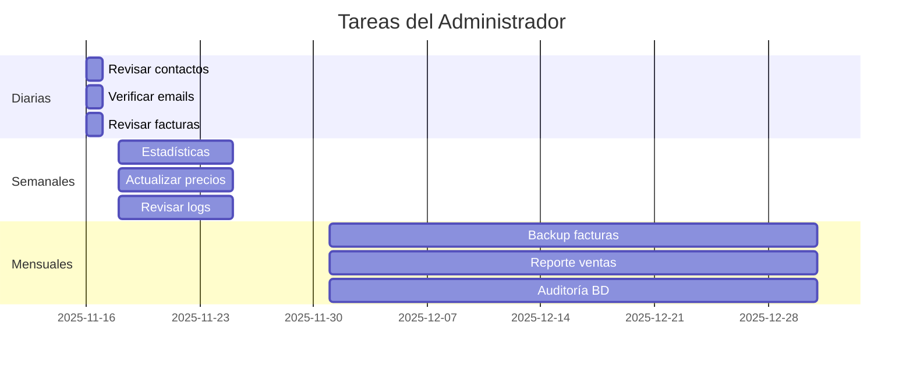

---

## ✅ Checklist Post-Conversión

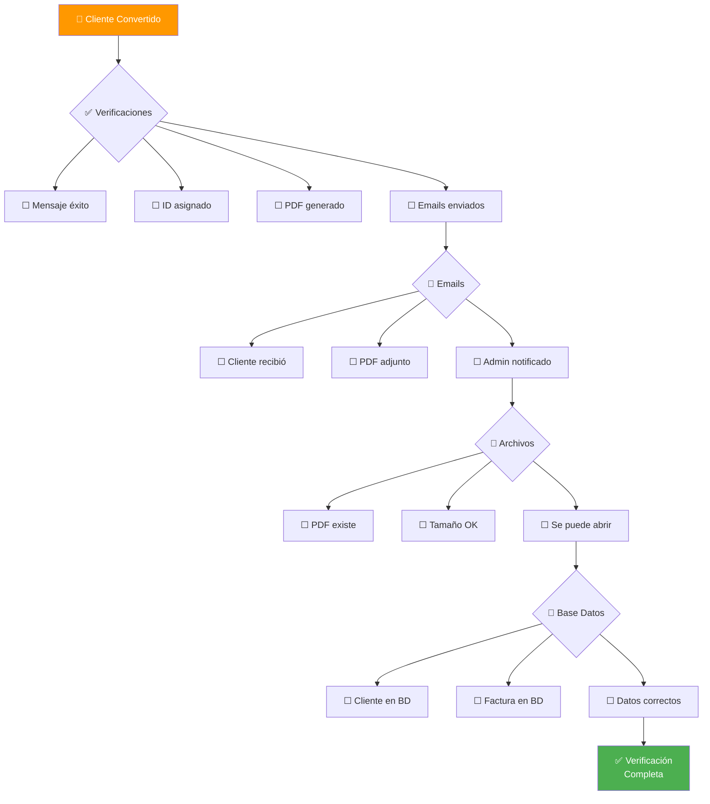

---

## 🚨 Troubleshooting

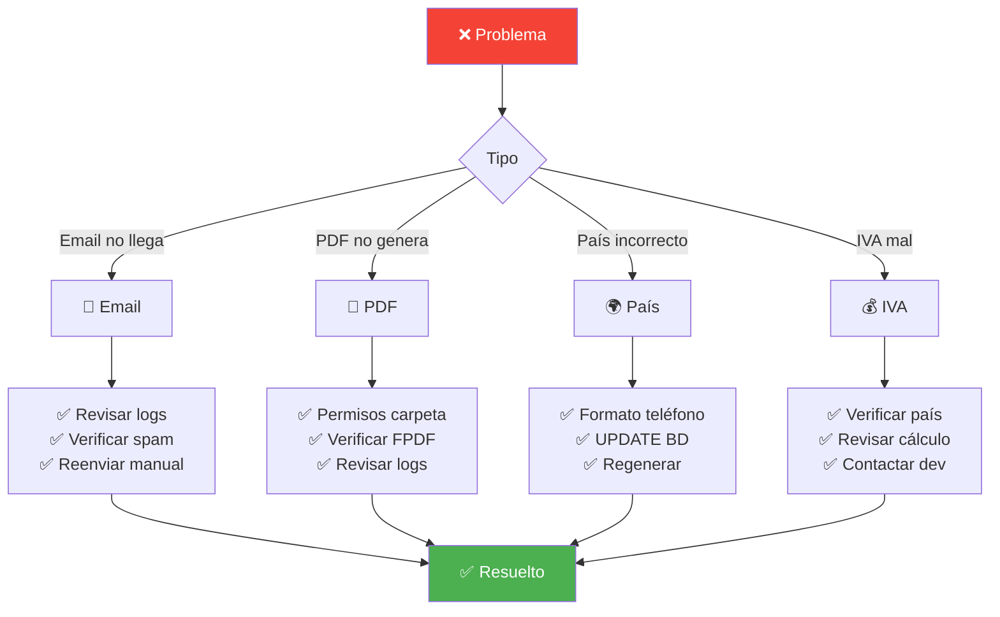

---

## 📞 URLs Importantes

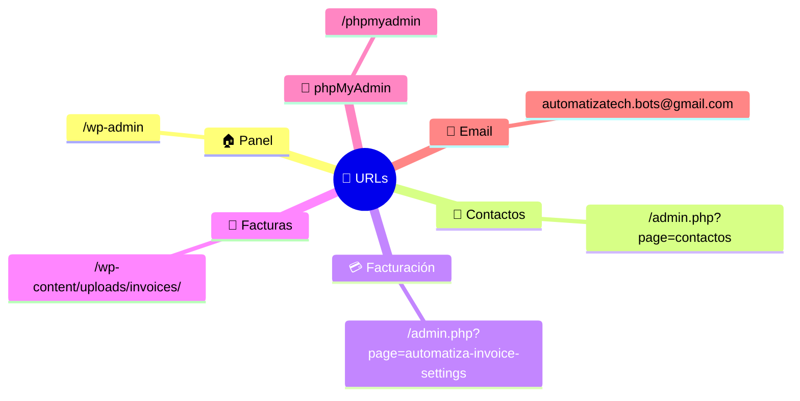

---

## 🎯 Flujo de Estados

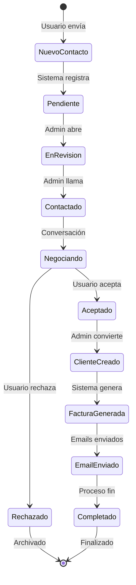

---

**Consultar MANUAL-USUARIO.md para detalles completos**

---

**AutomatizaTech Development Team - Nov 2025**

> 💡 Compatible con: GitHub, VSCode (ext. Mermaid), GitLab, Notion, Obsidian
