# 🔧 Diagrama Visual - Administrador Backend (Mermaid Preview Plugin)

**Sistema AutomatizaTech - Panel Admin**  
**Versión:** 2.0 - Font Awesome Icons

---

## 📊 Panel de Administración

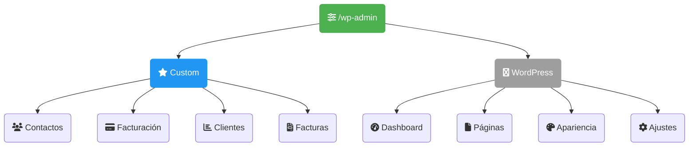

---

## 🔄 Flujo de Trabajo Admin

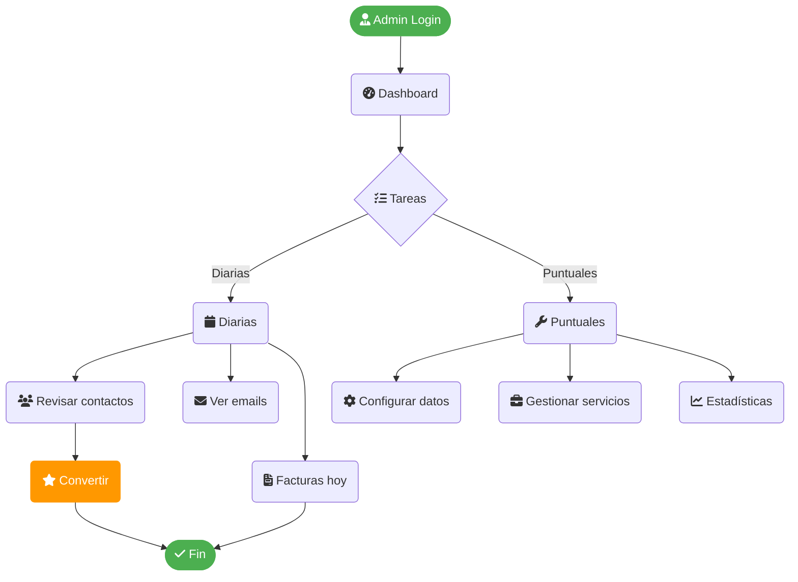

---

## 👥 Gestión de Contactos

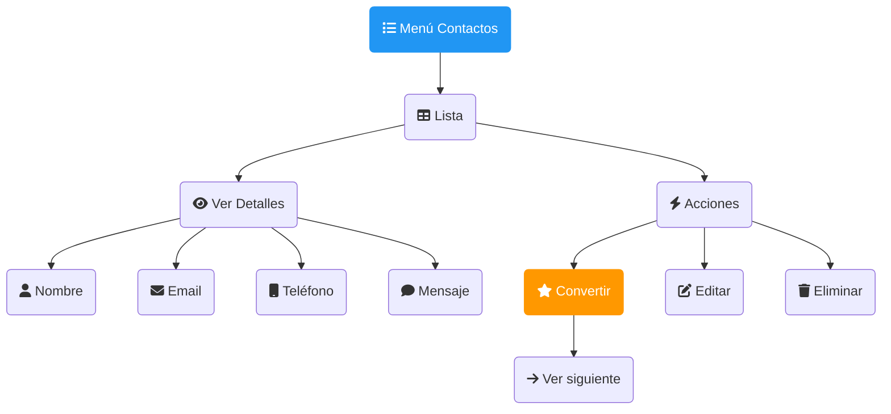

---

## 💳 Conversión: Contacto → Cliente

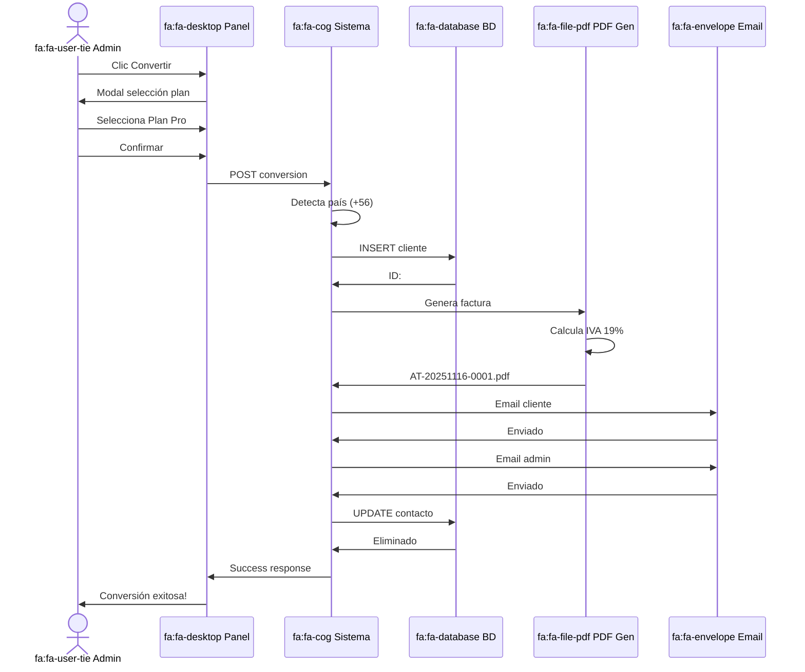

---

## ⚙️ Configurar Facturación

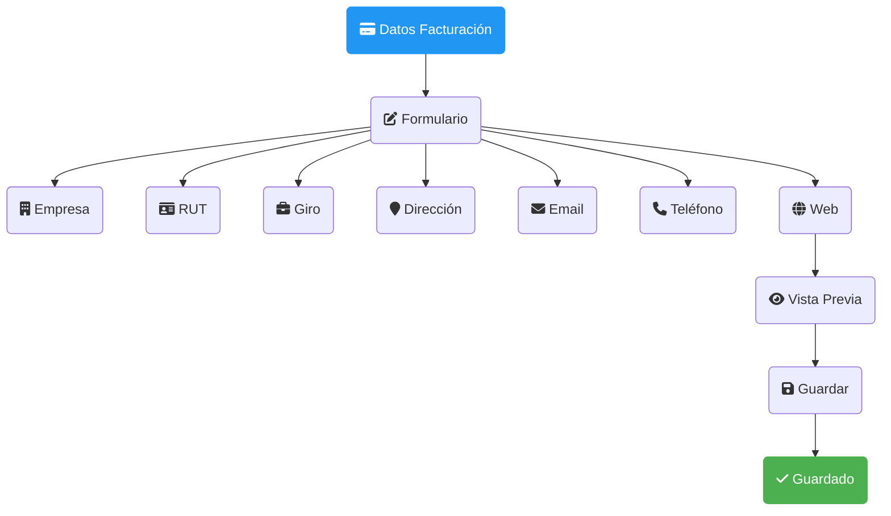

---

## 💼 Gestionar Servicios (BD)

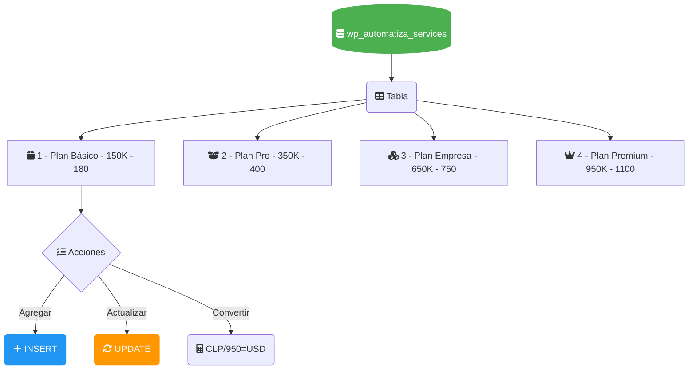

---

## 📊 Estadísticas y Monitoreo

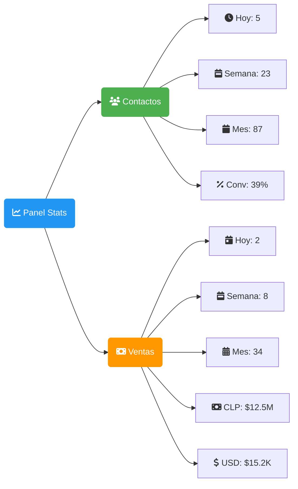

---

## 📧 Sistema Emails Admin

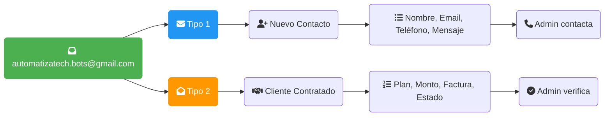

---

## 🔍 Acceso a Facturas

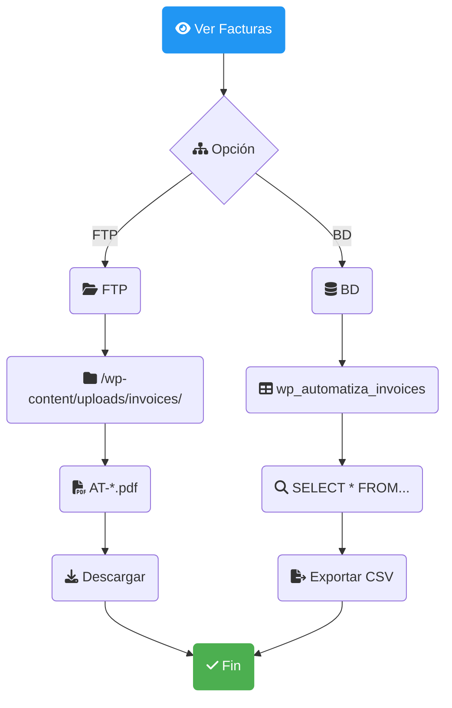

---

## 🛠️ Calendario Tareas

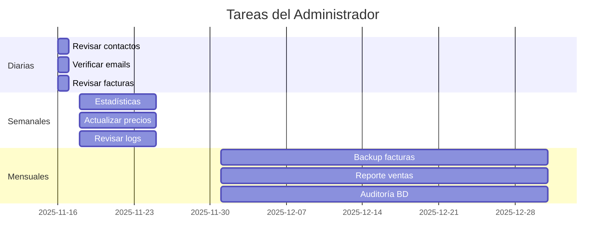

---

## ✅ Checklist Post-Conversión

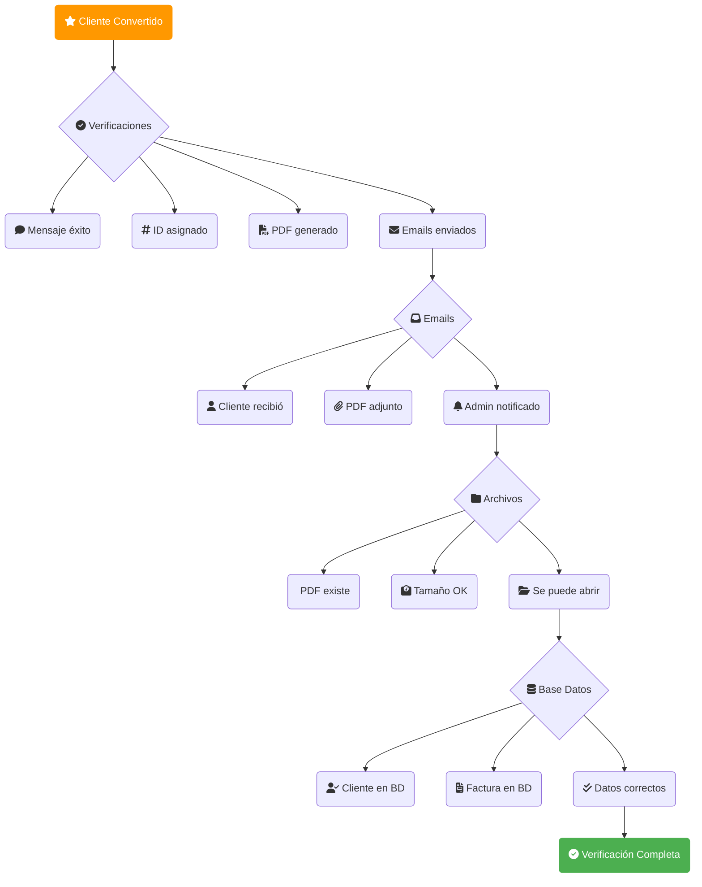

---

## 🚨 Troubleshooting

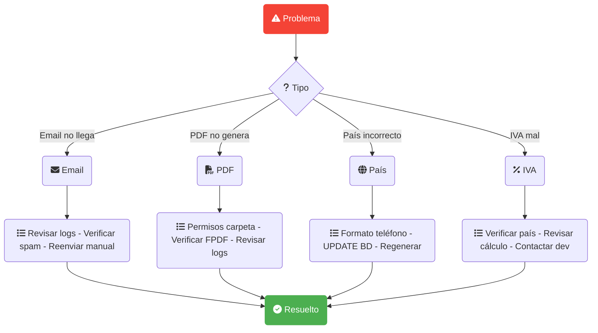

---

## 📞 URLs Importantes

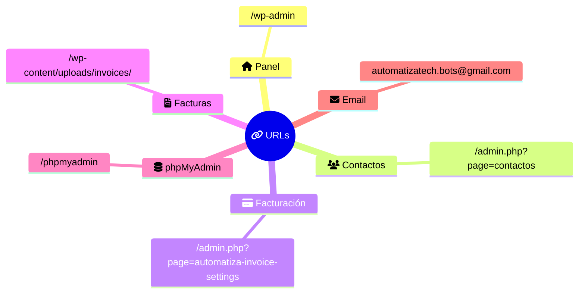

---

## 🎯 Flujo de Estados

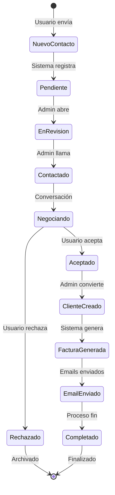

---

## 🔄 Ejemplo Complejo con Decoradores

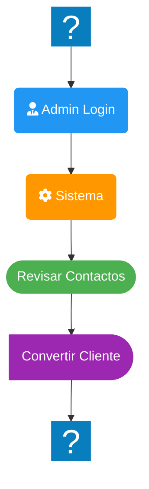

---

**Consultar MANUAL-USUARIO.md para detalles completos**

---

**AutomatizaTech Development Team - Nov 2025**

> 💡 Compatible con: Mermaid Preview Plugin (VSCode), GitHub, GitLab, Notion
> 📦 Usa Font Awesome Icons en lugar de emojis para mejor renderizado
